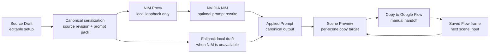
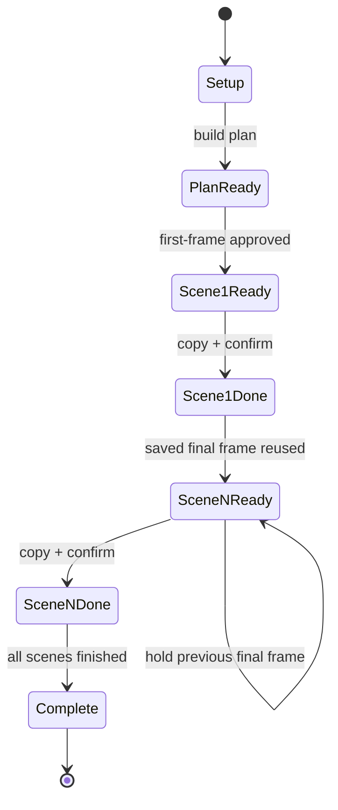
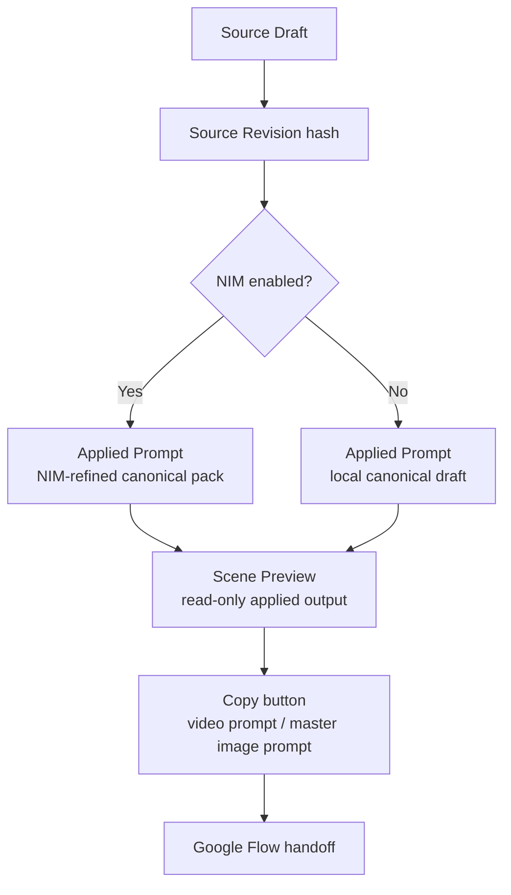
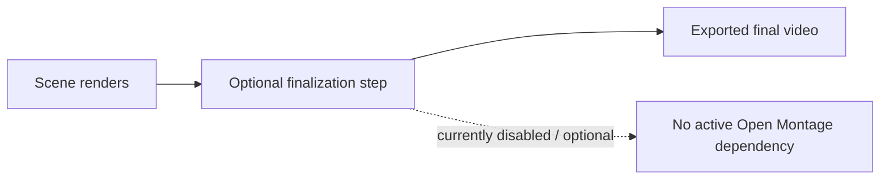

# ai-miniature-timelapse

Miniature construction timelapse pipeline implementing **Reference-Frame Relay v2.0**.

---

## 1. Immutable Security Contract

> [!IMPORTANT]
> **STRICT SECURITY RULE**: Real API keys or secrets MUST NEVER be hardcoded or committed anywhere.
> Always use placeholder tokens syntax: `<NVIDIA_API_KEY>`, `<SESSION_TOKEN>`, or `<ALLOWED_ORIGIN>`.

---

## 2. Documentation Directory

For complete operational and deployment details, consult the canonical guides:

- 📖 **[Execution Guide](docs/run-guide.md)**: Local setup, NIM proxy boot, port allocations, and QA test suite execution.
- 🛠️ **[Operations & Recovery Guide](docs/ops-guide.md)**: Architecture, log redaction, process monitoring, 5 error failure recovery runbooks, and rollback triggers.
- 🚀 **[Deploy & Release Checklist](docs/deploy-checklist.md)**: Pre-release verification checklist, 7-step release sequence, post-release smoke test, and reverse rollback order.
- 📐 **[Reference Specification](docs/reference-frame-relay-spec.md)**: Canonical Reference-Frame Relay v2.0 specification.

---

## 3. Overview & Supported Profiles

AI-assisted miniature timelapse generator implementing [Reference-Frame Relay v2.0](docs/reference-frame-relay-spec.md). The project is intentionally built for **Google Flow** as the manual video-generation target, with deterministic relay state machines, NIM proxy integration, and a browser-based Relay Runner UI.

Important Flow constraints:

- Google Flow does **not** provide a public API path for this workflow, so the app is designed around manual browser handoff and scene-by-scene copying.
- Video generation is organized in **10-second increments** because the relay system depends on saved-frame continuity between scenes.
- The UI therefore focuses on prompt planning, prompt copying, and frame handoff rather than direct video automation.

| Profile | Workflow Mode | Duration | Scenes | Use Case |
|---------|---------------|----------|--------|----------|
| `architecture.korean` | REFERENCE_FRAME_RELAY | 30s / 60s | 3 / 6 | Korean Hanok construction (foundation → roof → walls/interior/garden/hero) |
| `vehicle.assembly` | REFERENCE_FRAME_RELAY | 30s / 60s | 3 / 6 | Vehicle assembly (10 categories: Chassis → Engine → Drivetrain → Interior → Body → Final) |
| `product.assembly` | REFERENCE_FRAME_RELAY | 10s / 30s / 60s | 1 / 3 / 6 | Product assembly (Disassembled → Component → Final) |
| `home_decor.diy` | SINGLE_CLIP_FROM_MASTER | 10s | 1 | Home decor DIY (Hook → Materials → Build → Mid-build → Detail → Reveal) |
| `cooking.miniature` | REFERENCE_FRAME_RELAY | 30s | 3 | Miniature cooking (Prep → Cook → Plate, ASMR audio only) |

---

## 4. System Flow & Design Notes

The app is intentionally structured as a relay system, not a generic prompt editor.

### 4.1 Data Flow



### 4.2 Relay State Flow



### 4.3 Prompt Lifecycle



### 4.4 Optional Stitching Path



### 4.5 Design Constraints That Shape the UI

- The browser and NVIDIA key never meet directly; the proxy is the only upstream path.
- Prompt copying must follow the rendered canonical output, not a stale input draft.
- Scene continuity is preserved by saved-frame relay, not repeated wording alone.
- The UI must not imply an active final-stitch path when that backend is disconnected or optional.
- Google Flow is a manual execution target, not an API-driven backend.
- Scene videos are planned and executed as 10-second units so each generated clip can become the next scene's start frame.
- `file://` access is intentionally discouraged because ES module, clipboard, and fetch behavior are inconsistent there.

### 4.6 Problems Solved

- Removed the confusion between `file://` and local HTTP serving.
- Stabilized `Video Prompt` copy so it matches the visible scene output.
- Prevented stale plans from being copied as if they were valid.
- Made Open Montage an explicit optional path instead of a misleading active dependency.

---

## 5. Strict Execution Order

Follow this exact sequence to run the system and verify quality:

### Step 1: Environment Setup & Dependencies
```bash
uv sync --all-extras
uv run playwright install chromium
```

### Step 2: Set Environment Variables (Placeholder syntax)
```bash
export NIM_API_KEY="<NVIDIA_API_KEY>"
export ALLOWED_ORIGIN="http://127.0.0.1:4173"
export NIM_PROXY_SESSION_TOKEN="<SESSION_TOKEN>"
```

### Step 3: Boot NIM Proxy Server (Terminal 1)
```bash
uv run python3 src/nim_proxy_server.py --host 127.0.0.1 --port 4174
```

### Step 4: Verify Proxy Health
```bash
curl -s http://127.0.0.1:4174/health
```
`GET /health` does not require an `Origin` header or `X-Session-Token`.

### Step 5: Start Relay Runner UI HTTP Server (Terminal 2)
```bash
python3 -m http.server 4173 --bind 127.0.0.1
```
Run this from the project root, then access the UI at `http://127.0.0.1:4173/ui/`.

### Step 6: Rewrite Smoke Check
```bash
curl -s -X POST http://127.0.0.1:4174/api/nim/rewrite \
  -H "Content-Type: application/json" \
  -H "Origin: http://127.0.0.1:4173" \
  -H "X-Session-Token: <SESSION_TOKEN>" \
  -d '{
    "schema_version": "2.0",
    "request_id": "11111111-1111-4111-8111-111111111111",
    "source_revision": "sha256:e3b0c44298fc1c149afbf4c8996fb92427ae41e4649b934ca495991b7852b855",
    "profile": {
      "id": "architecture.korean",
      "version": "1.0",
      "workflow_mode": "REFERENCE_FRAME_RELAY"
    },
    "subject": {
      "topic_label": "Architecture-Hanok"
    },
    "style_bible": {
      "visual_style": "cinematic miniature timelapse"
    },
    "scenes": [
      {
        "id": 1,
        "name": "Foundation and Walls",
        "start_state": "Empty soil surface with no materials placed yet.",
        "ordered_actions": [
          "Measure the foundation footprint.",
          "Place the first stone course."
        ],
        "end_state": "Foundation footprint is laid and the first wall course is complete.",
        "local_first_frame_prompt": "Ultra realistic macro photography of an empty hanok build site with only giant human hands beginning the first placement.",
        "local_video_prompt": "Hands-only miniature construction timelapse that completes foundation setup and the first wall course, then stops before roofing begins."
      }
    ],
    "mutable_fields": [
      "scenes.*.first_frame_prompt",
      "scenes.*.video_prompt"
    ],
    "immutable_rules": [
      "Never expose miniature people.",
      "Preserve scene order and identity."
    ]
  }'
```
Browser clients must not send the NVIDIA API key directly. The browser talks only to the local proxy; the upstream key is injected into the proxy through `NIM_API_KEY`.

### Step 7: Execute QA & Test Suites
```bash
# Python Unit & Integration Tests (325 tests)
uv run pytest tests/ --ignore=tests/browser -v

# Playwright E2E & Responsive QA Tests (34 tests)
uv run pytest tests/browser/ -v

# Full Suite Execution (359 tests)
uv run pytest tests/ -v
```

---

## 6. Project Structure

```
ai-miniature-timelapse/
├── src/
│   ├── domain.py               # Canonical domain models (Project, Scene, AssetRef, RelayBranch)
│   ├── relay_state.py          # Relay state machine (Section 10)
│   ├── profile_types.py        # Profile registry & interface (Section 13)
│   ├── profiles/               # 5 profile implementations
│   │   ├── architecture.py     # Korean Hanok
│   │   ├── vehicle.py          # Vehicle assembly
│   │   ├── product.py          # Product assembly
│   │   ├── home_decor.py       # Home decor DIY
│   │   └── cooking.py          # Miniature cooking
│   ├── serializers.py          # Canonical prompt serialization (Section 11.6)
│   ├── nim_proxy_server.py     # FastAPI NIM proxy (Section 14)
│   ├── nim_client.py           # NIM async client with retry/fallback
│   ├── schema_validator.py     # JSON Schema validation
│   └── persistence.py          # Project persistence (Section 16)
├── tests/
│   ├── domain/                 # Domain model & source revision tests
│   ├── profiles/               # Profile traceability & scene boundary tests
│   ├── nim/                    # NIM contract, proxy & secret redaction tests
│   ├── relay/                  # Relay state machine tests
│   ├── serializers/            # Serialization & copy action tests
│   ├── persistence/            # Persistence round-trip tests
│   └── browser/                # Playwright E2E & responsive QA browser tests
├── ui/
│   ├── index.html              # Relay Runner UI (Section 15)
│   ├── app.js                  # ES module core logic
│   ├── error_handling.js       # Sanitized error display adapter
│   └── styles.css              # UI styling & responsive layouts
├── docs/
│   ├── run-guide.md            # Local Run & QA Guide
│   ├── ops-guide.md            # Operations & Failure Recovery Guide
│   ├── deploy-checklist.md     # Deploy Checklist & Rollback Order
│   └── reference-frame-relay-spec.md # Canonical v2.0 specification
└── schema/                     # JSON Schemas for validation
```

---

## 7. Reverse Rollback Execution Order

If a local or deployed environment encounters critical failure, follow this exact reverse sequence:

1. **Stop UI**: `kill -9 $(lsof -t -i:4173)`
2. **Stop Proxy**: `kill -9 $(lsof -t -i:4174)`
3. **Purge Secrets**: `unset NIM_API_KEY ALLOWED_ORIGIN NIM_PROXY_SESSION_TOKEN`
4. **Git Rollback**: `git checkout <STABLE_TAG>`
5. **Clear Cache**: `rm -rf .pytest_cache ui/.cache src/__pycache__ output/*`
6. **Verify Idle**: `lsof -i :4173 -i :4174`
