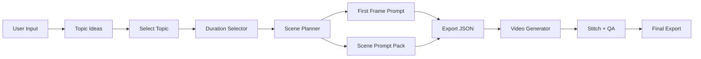

# AI Miniature Timelapse Pipeline

This project turns a topic such as a building type, object, or landmark into a reusable miniature construction timelapse prompt package.

## Goal

- Accept a topic and video duration.
- Generate a viral-friendly concept shortlist.
- Convert the chosen concept into scene-by-scene prompts.
- Output prompt bundles for Google Flow or any similar video generator.
- Keep visual continuity across scenes.

## Pipeline Overview



## Operating Assumptions

- Style target: ultra realistic miniature construction timelapse.
- Primary visual device: giant human hands only.
- No miniature people.
- Scene order follows a real construction sequence.
- 30 seconds maps to 3 scenes.
- 60 seconds maps to 6 scenes.

## Prompt Rules

### Shared Style Block

- ultra realistic macro photography
- miniature construction site
- giant human hands only
- ultra fast timelapse speed
- multiple rapid scene cuts
- cinematic macro photography
- cinematic studio lighting
- shallow depth of field

### Negative Prompt Block

Use the same negative prompt in every scene.

```text
text, subtitle, caption, watermark, logo, burnt-in text, overlay text, bad anatomy, deformed hands, blurry
```

## Scene Templates

### 60-second format

1. Foundation
2. Wall and windows
3. Roofing
4. Exterior finishing
5. Painting and weathering
6. Landscaping and reveal

### 30-second format

1. Foundation and walls
2. Roofing and exterior
3. Painting, landscaping, and reveal

## Suggested Runtime Stages

1. `topic_generation`
2. `duration_selection`
3. `first_frame_prompt`
4. `scene_prompt_pack`
5. `export_bundle`
6. `render_orchestrate`
7. `qc_and_stitch`

## Recommended Output Files

- `project.json`
- `topics.json`
- `first_frame_prompt.txt`
- `scene_prompts.json`
- `google_flow_prompts.txt`
- `qa_report.json`

## Next Automation Layer

If you want to extend this into real rendering automation, the next step is:

- connect a video generation API or Google Flow manual handoff
- stitch clips with FFmpeg
- run visual QA on frames
- regenerate only failing scenes

