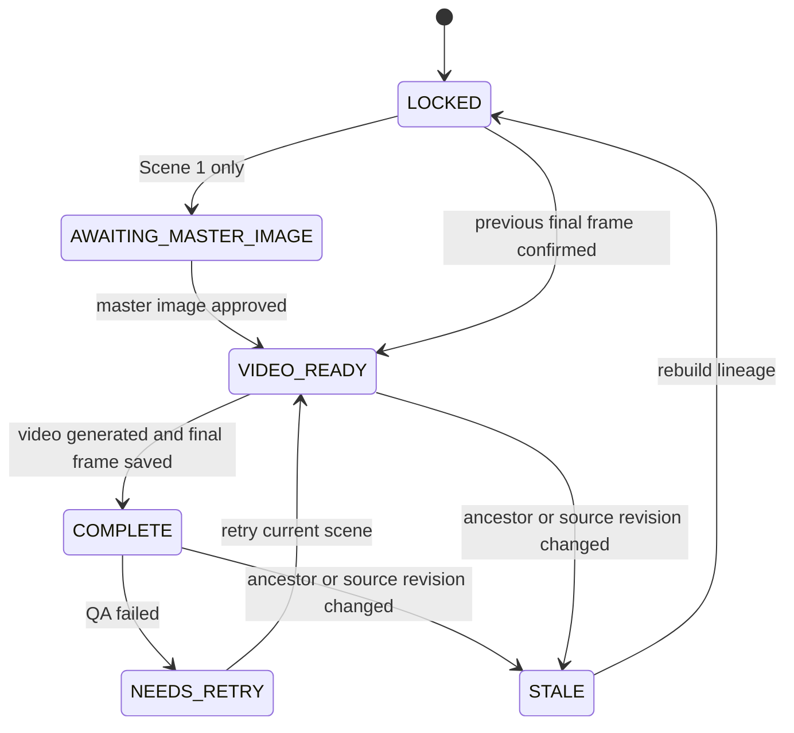

# Reference-Frame Relay Pipeline Specification

## 0. Document Status

- Product: AI Miniature Timelapse Launcher
- Specification version: 2.0
- Status: implementation baseline
- Default language: English prompt output
- Default video duration: 30 seconds
- Default scene count: 3 scenes
- Default clip duration: 10 seconds
- Default Flow execution profile: a model/profile that supports 10-second
  `Frames to Video: First`
- Primary manual renderer: Google Flow
- Optional prompt writer: NVIDIA NIM
- Source reference: <https://www.youtube.com/watch?v=xF-h4xyJ3Aw>
- Official Flow capability references:
  - <https://support.google.com/flow/answer/16352836>
  - <https://support.google.com/flow/answer/16353334>
  - <https://support.google.com/flow/answer/16935718>

This document is the source of truth for the next architecture of the project.
Implementation details may change, but the invariants, state transitions, prompt
contracts, and acceptance criteria in this document must remain true unless this
specification is updated first.

The four files under `docs/reference_prompts/` are preserved source material.
They are normative for creative intent, selection flow, required phrases, scene
logic, camera, and audio. If an older reference sentence conflicts with a later
product requirement or with the relay mechanism, this specification records the
resolution and is authoritative for implementation. An implementer MUST NOT
silently discard a reference rule merely because the current code does not
support it.

Normative terms are used as follows:

- **MUST** and **MUST NOT** describe requirements that block release.
- **SHOULD** and **SHOULD NOT** describe strong defaults that may be overridden
  only with a documented reason.
- **MAY** describes optional behavior.

The phrase "exact frame" in this specification means that the saved Flow frame is
supplied through Flow's start-frame control as visual ground truth. It does not
claim pixel-identical generative output after encoding or model processing.

The term "confirmation" means a user assertion that an external Flow action was
completed. The browser application cannot inspect a separate Flow project and
MUST NOT present that assertion as automatically verified.

## 1. Problem Statement

The current application can create a multi-scene prompt pack, but the resulting
videos often do not resemble a single continuously constructed object. A later
scene may restart from a different object, a different workbench, a different
camera angle, or a different architectural interpretation.

The main product problem is not a lack of continuity wording. The current prompts
already repeat continuity wording many times. The missing element is a reliable
asset handoff:

1. Scene 1 is generated from one approved master image.
2. Scene 1 video is rendered.
3. The exact final frame of Scene 1 is saved as an image.
4. That image is uploaded as the sole visual input for Scene 2.
5. Scene 2 is rendered from that image.
6. The process repeats until the final scene.

Prompt continuity is a supporting instruction. Reference-frame continuity is the
actual mechanism that preserves object identity.

## 2. Evidence From the Reference Workflow

The reference video describes the following workflow:

- Around 02:27, generate the master image prompt that becomes the visual skeleton.
- Around 03:04, generate two candidate images and choose one approved image.
- Around 03:22, use the approved image with the Scene 1 video prompt.
- Around 03:54, move to the final frame of the generated video.
- Around 03:57, save the final frame as an image.
- Around 04:18, copy the Scene 2 prompt.
- Around 04:23, add the saved final-frame image to the Scene 2 prompt.
- Around 04:31, repeat the same procedure for Scene 3.
- Around 06:04, summarize the workflow as image prompt, approved image, video
  prompt, final-frame extraction, and sequential reuse.
- Around 06:31, compare results with real references and regenerate only the
  scene that contains an incorrect roof, color, material, or structural detail.

The reference workflow does not create a new independent first-frame image for
every scene. Only the first scene uses a generated master first frame. Every later
scene uses the previous video's saved final frame.

### 2.1 Current Google Flow Capability Baseline

The implementation MUST use a Flow execution profile instead of assuming that
every Flow model supports the same controls.

As of the capability pages linked in Section 0:

- Google Flow supports adding a start frame through `Video → Frames`.
- A frame saved from a prior Flow video can be reused as a future start frame.
- Flow provides multiple models with different duration and frame capabilities.
- Ten-second generation is available only on compatible profiles, including
  profiles documented by Google as supporting 10-second video generation.
- Some Veo profiles support 4, 6, or 8 seconds but not 10 seconds.
- Feature availability can vary by model, account tier, platform, region, and
  time.

The project targets 30-second and 60-second outputs as 3 or 6 clips of 10 seconds.
Therefore, the UI MUST either:

1. select a Flow profile that supports 10-second `Frames to Video: First`, or
2. block generation with a capability error and explain which profile or duration
   must change.

The first implementation MUST NOT silently convert a 30-second, 3-scene plan into
three 8-second clips. A future dynamic-timeline version MAY support this, but it
requires re-planning scene count and total duration.

### 2.2 Flow Interaction Terminology

The UI and documentation MUST use current Flow concepts:

- **Master image**: the approved Scene 1 start image.
- **Start frame**: the image added through Flow's Frames control.
- **Saved frame**: a frame saved from a generated video into the Flow project.
- **Scenebuilder**: Flow's clip assembly surface.
- **Local handoff image**: an optional downloaded copy used by the CLI workflow.

`Ingredient` and `start frame` are not interchangeable in this workflow. The
previous final frame MUST be attached as the next scene's start frame. It MAY also
be retained as a project asset, but an ingredient-only reference does not satisfy
the start-frame invariant.

## 3. Root-Cause Analysis

### 3.1 Prompt-Only Continuity

The existing application relies on sentences such as:

```text
The final frame of each scene must become the exact starting frame of the next scene.
```

This instruction cannot guarantee visual continuity when Scene 2 starts without
the actual final-frame image from Scene 1. A video model cannot reconstruct an
exact unknown frame from text alone.

### 3.2 Conflicting Motion Instructions

The existing prompt can include both:

```text
multiple rapid scene cuts
```

and:

```text
no cuts, no scene breaks
```

These instructions conflict. The new prompt contract uses rapid procedural
timelapse motion inside one locked composition. It does not request camera cuts.

### 3.3 Generic Prompts Overpower Subject Identity

Architecture prompts currently spend many tokens on generic phrases such as
`miniature construction site`, `giant hands`, and `cinematic macro photography`,
but provide too little subtype-specific construction logic.

For a Korean hanok, the prompt must prioritize:

- compacted-earth site and stone footings
- timber sill beams and timber columns
- mortise-and-tenon assembly
- purlins, rafters, and curved black giwa roof tiles
- white hanji doors and windows
- restrained dancheong placement
- a single coherent hanok silhouette

Without this identity lock, the model may drift into a stone castle, church,
palace tower, or unrelated fantasy building.

### 3.4 Scene Name Instead of Scene Action

Text such as `scene: Roofing and Exterior` is metadata, not a useful motion
description. Each scene needs:

- exact starting state
- ordered hand actions
- parts and materials used
- exact ending state
- forbidden changes

### 3.5 Repeated First-Frame Semantics

Later scenes must not contain language that asks the model to create, redesign,
or imagine a new first frame. They must contain one of these modes:

```text
MASTER_IMAGE
```

for Scene 1, or:

```text
PREVIOUS_FINAL_FRAME
```

for Scene 2 and later.

### 3.6 NIM Can Break Structural Rules

An LLM rewrite may:

- remove scene headers
- add a first-frame prompt to every scene
- change the fixed negative prompt
- merge scenes
- invent a new camera setup
- omit the image handoff instruction

NIM must therefore be treated as a constrained wording assistant, not as the
owner of the workflow structure.

### 3.7 Applied Prompt and Preview Can Diverge

The current UI can display locally reconstructed scene text even when the
Applied Prompt came from NIM. Copy actions can also rebuild a local template
instead of copying the visible applied scene block.

The new system has one canonical applied prompt model. Applied Prompt, Scene
Preview, per-scene copy, all-scenes copy, JSON download, and CLI export must all
read from the same canonical model.

### 3.8 Static Model-Capability Assumptions

The original routine assumes three or six 10-second clips. Flow model capabilities
are not uniform. If the app does not record the selected Flow execution profile,
it can generate a valid-looking 30-second plan that the selected model cannot
render as specified.

The canonical plan therefore needs a versioned Flow execution profile containing:

- Flow model identifier
- supported clip durations
- selected clip duration
- start-frame support
- optional end-frame support
- audio behavior
- region or account caveats shown to the user

### 3.9 Manual Boundary Hidden as Automation

Google Flow is a separate interactive product. This project does not have an
official Flow API integration. The browser cannot independently know whether:

- the correct frame was attached
- the user selected the intended Flow model
- generation succeeded
- the saved frame belongs to the expected clip
- a Flow project asset was renamed or deleted

The UI MUST label confirmations as user-confirmed assertions. It MUST NOT report a
Flow generation as automatically verified unless a later supported integration
or local file watcher has actually verified an artifact.

### 3.10 Stale and Out-of-Order Asynchronous Results

A NIM response can arrive after the user changes the topic, subtype, materials, or
camera. Applying that response would overwrite a newer Source Draft with a stale
plan.

Every build request MUST carry:

- a monotonically increasing request ID
- a deterministic Source Draft revision hash
- an abort signal

The response may be applied only when its request ID and revision hash still match
the current draft. Older responses MUST be discarded without changing the
canonical plan.

## 4. Product Goals

1. Preserve the reference video's proven final-frame relay workflow.
2. Generate the entire plan once, then guide execution one scene at a time.
3. Require only the manual actions that Google Flow cannot expose through an API.
4. Prevent Scene 2 and later from starting until the previous final frame exists.
5. Keep subject identity, camera, lighting, scale, and object position stable.
6. Make each scene prompt mechanically and materially specific.
7. Keep mandatory negative prompts identical across all output surfaces.
8. Allow NVIDIA NIM to improve wording without changing system invariants.
9. Support architecture, vehicles, products, home decor, characters, fantasy,
   and sci-fi through one shared workflow shape.
10. Make failures local: regenerate one scene without rebuilding the whole plan.

## 5. Non-Goals

- Generating or rendering images or videos inside this application. It outputs
  text prompts and coordinates external Flow actions only.
- Directly automating Google Flow generation without an official API.
- Bypassing Google authentication, quotas, or product restrictions.
- Claiming that prompt text alone can guarantee exact visual continuity.
- Generating a new independent image for every scene.
- Automatically selecting the best Flow result without access to result media.
- Persisting raw NVIDIA API keys in project files or browser local storage.

## 6. Core Product Principle

> Plan once, approve one master image, then relay the exact final frame through
> every remaining scene.

The application must separate two concerns:

- Planning: generate all scene actions and prompt text in one operation.
- Execution: unlock and copy only the prompt that can be safely rendered next.

## 7. System Invariants

These rules are mandatory and machine-validated.

### 7.1 First-Frame Invariant

- Exactly one master first-frame prompt exists.
- It belongs to Scene 1 only.
- Scene 2 and later have no generated first-frame prompt.

### 7.2 Reference-Frame Invariant

- Scene 1 input mode is `MASTER_IMAGE`.
- Scene N input mode, where N > 1, is `PREVIOUS_FINAL_FRAME`.
- Scene N references the logical handoff from Scene N-1.
- In Flow-project mode, the logical handoff points to a saved Flow project frame.
- In local-file mode, the logical handoff points to
  `scenes/scene_{N-1}_last_frame.png`.
- A later scene cannot be marked ready until the prior final frame is confirmed.
- The previous final frame MUST be added using Flow's start-frame control, not
  only as an ingredient or as text in the prompt.

### 7.3 Negative-Prompt Invariant

Every scene ends with exactly this fixed text:

```text
Negative Prompt: text, subtitle, caption, watermark, logo, burnt-in text, overlay text, bad anatomy, deformed hands, blurry, miniature people, small people, tiny workers, human figures
```

This line incorporates the project's later, stricter hands-only requirement.
Genre-specific exclusions such as floating parts, a changed building type,
shaky camera, music, or voice belong in `Template Exclusions`, not in the fixed
negative line.

The word `watermark` in this negative prompt means "do not generate a fictional
burnt-in watermark inside the scene." The product MUST NOT remove, obscure, or
instruct users to remove Flow provenance, SynthID, platform labels, or any
mandatory AI-content disclosure.

### 7.4 Hands-Only Invariant

Every scene must explicitly state:

```text
giant human hands only; no miniature people, tiny workers, human figures, faces, or full bodies
```

### 7.5 Camera Invariant

All scenes use one camera bible:

- same lens character
- same viewpoint
- same framing
- same aspect ratio
- same camera height
- same subject scale
- same lighting direction
- no table, tray, or background replacement

Camera movement is allowed only for the final reveal, and only after the hands
leave the frame.

### 7.6 Identity Invariant

Each subtype defines a visual identity lock. Every scene repeats the compact
identity lock before its scene-specific action. A scene must not introduce a
different building type, vehicle model, product family, or fantasy creature.

### 7.7 Physical-Progress Invariant

- Every new part is moved by a visible hand or tool.
- Parts do not float, teleport, duplicate, or vanish before attachment.
- Installed parts remain installed.
- The object only progresses forward.
- A scene may not rebuild an already completed step.

### 7.8 Canonical-Output Invariant

The following UI and exported outputs must derive from the same applied model:

- Applied Prompt
- Scene Preview
- Copy Current Stage
- Copy Video Prompt
- Copy All Scenes
- downloaded JSON
- CLI prompt pack
- per-scene Markdown files

### 7.9 Capability Invariant

- A 30-second plan has 3 scenes only when the selected Flow profile supports
  10-second start-frame video generation.
- A 60-second plan has 6 scenes under the same condition.
- Unsupported profile and duration combinations MUST block plan execution.
- The capability profile and the capability snapshot version MUST be stored in
  the canonical plan.

### 7.10 Source-Revision Invariant

- Every canonical plan records the Source Draft revision hash from which it was
  generated.
- Editing any prompt-affecting Source Draft value marks the applied plan stale.
- A stale plan MUST NOT unlock relay actions.
- The user MUST rebuild the plan before copying or advancing a stale scene.

### 7.11 Provenance Invariant

Every plan records:

- `prompt_source`: `local`, `nim`, or `nim_partial_fallback`
- NIM model name when NIM is used
- scenes that fell back to deterministic local text
- creation timestamp
- schema version
- Source Draft revision hash

Raw API keys, bearer tokens, and full authorization headers MUST never appear in
the plan, status text, exported JSON, logs, copied commands, or Git history.

## 8. High-Level Architecture

```mermaid
flowchart LR
  A["Editable Source Draft"] --> B["Local Deterministic Planner"]
  B --> C["Optional NIM Wording Rewrite"]
  C --> D["Invariant Normalizer"]
  D --> E["Canonical Applied Plan"]
  E --> F["Sequential Relay Runner"]
  F --> G["Google Flow: Generate and approve master image"]
  G --> H["Google Flow: Render Scene 1"]
  H --> I["Confirm output and saved final frame"]
  I --> J["Google Flow: Use saved frame for Scene 2"]
  J --> K["Continue serially"]
  K --> L["Stitch and QA"]
```



## 9. Domain Model

### 9.1 Project

```json
{
  "schema_version": "2.0",
  "topic": "Korean hanok",
  "topic_label": "Architecture-Hanok",
  "genre": "architecture",
  "subtype": "hanok",
  "duration_seconds": 30,
  "scene_count": 3,
  "format": "9:16",
  "workflow_mode": "REFERENCE_FRAME_RELAY",
  "flow_execution_profile_id": "flow.frames_first.10s",
  "source_revision": "sha256:...",
  "generation_request_id": "uuid",
  "prompt_source": "local|nim|nim_partial_fallback",
  "style_bible": {},
  "capability_snapshot": {},
  "provenance": {},
  "scenes": []
}
```

`source_revision` is computed from the canonical JSON serialization defined in
Section 14. Every Applied Plan, scene card, copy action, and export MUST carry the
same revision.

### 9.2 Flow Execution Profile

Flow capabilities are configuration data, not prompt-template constants:

```json
{
  "id": "flow.frames_first.10s",
  "display_name": "Frames to Video: First, 10 seconds",
  "provider": "google_flow",
  "model_label": "user-visible-current-label",
  "supports_start_frame": true,
  "supported_clip_durations_seconds": [10],
  "supports_prompt_audio": "yes|no|unknown",
  "last_verified_at": "2026-07-24T00:00:00Z",
  "verification_url": "https://support.google.com/flow/answer/16352836"
}
```

The registry MUST be editable without changing prompt code. When the capability
is `unknown`, the UI warns and requires acknowledgement; it does not claim support.

### 9.3 Style Bible

```json
{
  "identity_lock": "single-story Korean hanok with ...",
  "materials": "warm timber, natural stone, white hanji, black giwa roof tiles",
  "camera": "locked 85mm-equivalent macro camera at a fixed 45-degree angle",
  "lighting": "soft daylight from camera-left with a warm rim light",
  "color_palette": "warm wood, white hanji, charcoal-black roof tiles",
  "workspace": "one compacted-earth miniature site on one fixed tray",
  "hands_rule": "giant human hands only ...",
  "motion_rule": "rapid procedural timelapse in one locked composition"
}
```

### 9.4 Asset Reference

An asset has a stable logical identity and one or more locators:

```json
{
  "logical_id": "scene_01_last_frame",
  "kind": "MASTER_IMAGE|FINAL_FRAME|VIDEO",
  "scope": "FLOW_PROJECT|LOCAL_FILE|BOTH",
  "flow_asset_id": null,
  "flow_asset_label": "Scene 01 final frame",
  "local_path": "scenes/scene_01_last_frame.png",
  "source_scene_id": 1,
  "confirmed_by_user": true,
  "confirmed_at": "2026-07-24T00:00:00Z",
  "content_hash": null
}
```

Rules:

- `flow_asset_id` is optional because Flow may not expose a stable public ID.
- `flow_asset_label` is a human-facing locator inside the Flow project.
- `local_path` is required only for CLI/download workflows.
- Browser confirmation proves only that the user asserted the asset exists.
- A local `content_hash` MAY be calculated when a file is supplied.
- A scene may not reference a plain string filename in canonical state; it
  references an `AssetRef.logical_id`.

### 9.5 Scene

```json
{
  "id": 1,
  "name": "Foundation and Walls",
  "duration_seconds": 10,
  "input_mode": "MASTER_IMAGE",
  "input_asset_ref": "scene_01_master",
  "first_frame_prompt": "...",
  "video_prompt": "...",
  "negative_prompt": "...",
  "start_state": "...",
  "ordered_actions": ["...", "..."],
  "end_state": "...",
  "handoff_asset_ref": "scene_01_last_frame",
  "source_revision": "sha256:...",
  "lineage_revision": "sha256:...",
  "status": "awaiting_master_image"
}
```

For Scene 2:

```json
{
  "id": 2,
  "input_mode": "PREVIOUS_FINAL_FRAME",
  "input_asset_ref": "scene_01_last_frame",
  "first_frame_prompt": "",
  "handoff_asset_ref": "scene_02_last_frame",
  "status": "locked"
}
```

`lineage_revision` hashes the current scene's input asset identity, prompt
revision, and every ancestor scene confirmation. If any ancestor is retried, all
descendant lineage revisions become stale.

## 10. Workflow State Machine

### 10.1 Project States

- `EMPTY`: no prompt pack has been generated.
- `PLANNING`: local plan or NIM rewrite is running.
- `READY`: canonical applied plan is valid.
- `IN_PROGRESS`: at least one scene is being executed.
- `COMPLETE`: all scene videos are confirmed.
- `ERROR`: generation failed and no valid fallback exists.

### 10.2 Scene States

- `LOCKED`: previous scene handoff is not confirmed.
- `AWAITING_MASTER_IMAGE`: Scene 1 master image prompt is ready.
- `VIDEO_READY`: required input is confirmed and the video prompt may be copied.
- `COMPLETE`: output video and final-frame handoff are confirmed.
- `NEEDS_RETRY`: result failed visual QA.
- `STALE`: an ancestor scene or prompt revision changed.

### 10.3 Allowed Transitions



The single `VIDEO_READY → COMPLETE` action is labeled:

```text
Confirm Video Generated + Final Frame Saved
```

This is intentionally one confirmation to minimize manual work. The confirmation
dialog summarizes both assertions and identifies the expected handoff asset. The
final scene uses `Confirm Final Video Generated`; saving its final frame is
optional but recommended for QA and thumbnail use.

### 10.4 Unlock Rule

When Scene N becomes `COMPLETE`, Scene N+1 becomes `VIDEO_READY` and its required
input is displayed using the best available locator:

```text
In Google Flow, select the saved frame labeled "Scene N final frame" as the only
start frame. If using downloaded files, upload scenes/scene_N_last_frame.png.
```

The unlock operation MUST verify that the confirmation and current lineage
revision match. A stale browser response or an old saved project state cannot
unlock a descendant.

### 10.5 Retry and Descendant Invalidation

Retrying Scene N is lineage-destructive for the active branch:

1. The UI explains that Scene N+1 through the final scene will become stale.
2. The user confirms the retry.
3. The existing successful branch is retained in immutable history.
4. Scene N returns to `VIDEO_READY` with the same original input asset.
5. Scene N+1 and later become `STALE`, then `LOCKED` after rebuilding.
6. New descendant scenes can unlock only from the newly confirmed Scene N frame.

The application MUST NOT silently delete old video or frame records. It stores a
new `branch_id` and marks the old branch inactive.

## 11. Prompt Architecture

### 11.1 Prompt Layers

Each scene prompt is assembled from deterministic layers:

1. Subject identity lock
2. Visual style and workspace lock
3. Input-frame contract
4. Exact scene start state
5. Ordered physical actions
6. Exact scene end state
7. Handoff instruction
8. Fixed negative prompt

NIM may rewrite layers 4 through 6 for clarity. It may not modify layers 1, 2,
3, 7, or 8.

### 11.2 Master First-Frame Prompt Contract

The Scene 1 image prompt must describe:

- the exact subject subtype
- a genuinely unstarted state
- all required raw materials visible and separated
- only giant hands
- fixed camera, workspace, lighting, and palette
- the first physically plausible placement action
- no completed version of the subject

It must not describe:

- an already completed foundation or assembled body
- a different architectural style
- miniature workers
- a hero reveal
- motion or timelapse

### 11.3 Video Prompt Contract

Every video prompt must begin with an input contract:

Scene 1:

```text
Start from the uploaded approved master image. The opening frame must match the
uploaded image exactly.
```

Scene 2 and later:

```text
Start from the uploaded final-frame image from Scene N-1. Treat that image as
immutable visual ground truth. Before motion begins, preserve its composition,
subject identity, installed parts, object placement, scale, camera, and lighting
as closely as the selected model allows. Do not redesign, reinterpret, clean up,
or rebuild any visible part.
```

Every video prompt must then state:

- one locked composition
- rapid timelapse hand movement
- ordered scene actions
- a concrete stop condition
- final-frame hold for extraction

### 11.4 Scene Tempo and Density Rule

ASMR pacing should feel brisk, but each scene must still show meaningful work.

- Non-final scenes should usually contain several distinct manipulation beats rather than one isolated action.
- Prefer 3 to 5 visible beats per scene when the duration allows it.
- A beat may be a setup action, an installation action, a tightening or fastening action, a detail action, or a cleanup action.
- Compression may merge time, but it must not collapse the scene into a single step, a before/after jump, or an already-finished state.
- Different scenes must still be clearly distinguishable by their main construction milestone.

If a profile only allows a short clip, preserve the same logic with fewer but still clearly separated beats.

### 11.5 Final-Frame Handoff Contract

Every non-final scene ends with:

```text
End on a clean, stable, motionless hold for the final 0.5 seconds. Keep every
installed part, tool, loose material, camera parameter, and light direction
unchanged so this exact frame can be saved and reused as the next scene input.
```

The final scene instead ends with:

```text
After construction is complete, the hands leave the frame. Hold the completed
subject, then perform one subtle cinematic pull-back without changing the
subject design.
```

### 11.6 No-Cut Motion Rule

Use:

```text
rapid procedural timelapse with fast hand motion in one locked camera composition
```

Do not use:

```text
multiple rapid scene cuts
```

when cross-scene continuity is the priority.

### 11.7 Canonical Prompt Serialization

The canonical full-plan serializer uses this field order:

```text
Project: {topic}
Topic Label: {Genre-Subtype}
Profile: {profile_id}@{profile_version}
Workflow: {workflow_mode}
Duration: {total_seconds}s ({scene_count} scene[s] × {clip_seconds}s)
Aspect Ratio: {aspect_ratio}
Source: {provenance source}
Source Revision: {source_revision}

MASTER IMAGE
First Frame Prompt: {scene_1.first_frame_prompt}
Template Exclusions: {scene_1.template_exclusions}
Negative Prompt: text, subtitle, caption, watermark, logo, burnt-in text, overlay text, bad anatomy, deformed hands, blurry, miniature people, small people, tiny workers, human figures

SCENE 1 — {name}
Input: {serialized AssetRef instruction}
Video Prompt: {video_prompt}
Template Exclusions: {template_exclusions}
Negative Prompt: text, subtitle, caption, watermark, logo, burnt-in text, overlay text, bad anatomy, deformed hands, blurry, miniature people, small people, tiny workers, human figures

SCENE 2 — {name}
Input: {serialized AssetRef instruction}
Video Prompt: {video_prompt}
Template Exclusions: {template_exclusions}
Negative Prompt: text, subtitle, caption, watermark, logo, burnt-in text, overlay text, bad anatomy, deformed hands, blurry, miniature people, small people, tiny workers, human figures
```

There is one `MASTER IMAGE` section per plan and no `First Frame Prompt` field in
Scene 2 or later. In single-clip mode there is only Scene 1.

Specialized copy actions are deterministic projections:

- `Copy Master Image Prompt`: first-frame prompt, applicable exclusions, and the
  immutable negative line
- `Copy Scene Video Prompt`: video prompt, applicable exclusions, and the
  immutable negative line
- `Copy Full Scene`: the exact visible serialized Scene block
- `Copy All`: the exact visible full-plan serialization

No copy action reads stale DOM text or regenerates a local template. It receives
the current canonical plan and current source revision.

### 11.7 Unified Editorial Voice

All profiles must read as if one production team authored them, without erasing
their genre-specific logic. English prompt prose follows this order:

1. exact subject and current physical state
2. hands-only and scale relationship
3. ordered physical actions
4. fixed workspace, camera, lighting, palette, and quality
5. continuity or final reveal instruction
6. audio instruction
7. template exclusions
8. immutable negative line

Style requirements:

- direct production language, not conversational explanation
- present tense and active physical verbs
- concrete nouns instead of generic `parts`, `materials`, or `details`
- no Korean UI translation, except the Korean home-decor narration embedded
  verbatim as content
- no model-facing meta phrases such as `as an AI`
- no repeated continuity paragraph inside one scene
- no claim that text can guarantee an exact generative result

Profile-required source phrases remain verbatim even when their rhythm differs
from the shared voice.

## 12. Hanok Identity and Construction Contract

### 12.1 Identity Lock

```text
A single coherent Korean hanok: one-story warm timber post-and-beam structure,
natural stone footings, white hanji doors and windows, deep curved black giwa
eaves, restrained dancheong only on appropriate beam ends and eaves. Never a
stone castle, church, European cottage, pagoda tower, or fantasy fortress.
```

### 12.2 Scene 1: Foundation and Walls

Start state:

- compacted earth tray
- empty rectangular footprint
- guide strings
- separate natural stone footings
- separate timber sill beams, columns, and hanji frames

Ordered actions:

1. Hands measure and tension the guide strings.
2. Hands place natural stone footings in a rectangular bay grid.
3. Hands seat timber sill beams on the footings.
4. Hands raise timber columns with visible mortise-and-tenon joints.
5. Hands connect lower and upper beams.
6. Hands insert white hanji door and window frames.

End state:

- one-story timber wall frame is complete
- roof structure is absent
- no landscaping or paint is added
- camera and workspace remain unchanged

### 12.3 Scene 2: Roofing and Exterior

Input:

- exact saved final frame from Scene 1

Ordered actions:

1. Hands place main crossbeams.
2. Hands add purlins and evenly spaced rafters.
3. Hands build the deep curved eave profile.
4. Hands place black giwa roof tiles row by row.
5. Hands install white hanji doors and exterior wood trim.
6. Hands add restrained architectural details without changing the footprint.

End state:

- roof and exterior shell are complete
- no landscaping is added
- no tower, new wing, or second floor appears

### 12.4 Scene 3: Painting, Landscaping, and Reveal

Input:

- exact saved final frame from Scene 2

Ordered actions:

1. Hands apply restrained protective wood finish.
2. Hands add limited dancheong accents to correct beam and eave areas.
3. Hands clean excess materials without moving the building.
4. Hands add a stone path, low wall, moss, grass, and one small pine.
5. Hands remove remaining tools.
6. Hands leave the frame.

End state:

- only the completed hanok and deliberate landscaping remain
- final reveal preserves the same building design

## 13. Reference Prompt Profile Integration

The four files below are normative source references:

- `docs/reference_prompts/korean_architecture_reference.md`
- `docs/reference_prompts/vehicle_assembly_reference.md`
- `docs/reference_prompts/home_decor_diy_reference.md`
- `docs/reference_prompts/miniature_cooking_reference.md`

The application MUST preserve their different content formulas. They share an
engine, not one forced scene structure.

The `현재 프로젝트 파이프라인과의 매핑` sections inside those source files are
historical notes about the pre-redesign code. They are not proof that a feature
currently works, and they are not normative module or line-number requirements.
The creative requirements above those notes remain source evidence; this
specification defines the new implementation mapping.

### 13.1 Shared Engine vs. Template-Owned Behavior

The shared engine owns:

- Source Draft editing
- optional NIM call
- canonical Applied Plan normalization
- prompt provenance
- start-frame asset lineage
- hands-only enforcement
- negative-prompt base enforcement
- copy, export, and status behavior
- retry invalidation
- QA hooks

Each template profile owns:

- selection workflow
- idea-generation rules
- allowed durations
- scene count
- scene names
- camera and lens
- lighting
- materials
- audio
- narration
- construction or transformation logic
- reveal behavior
- template-specific exclusions

The profile interface MUST contain:

```json
{
  "profile_id": "architecture.korean",
  "profile_version": "1.0",
  "topic_label": "Architecture-Hanok",
  "workflow_mode": "REFERENCE_FRAME_RELAY",
  "allowed_total_durations": [30, 60],
  "default_total_duration": 30,
  "clip_duration_seconds": 10,
  "scene_plans": {},
  "selection_schema": [],
  "style_bible_factory": "function",
  "first_frame_factory": "function",
  "scene_prompt_factory": "function",
  "audio_contract": {},
  "negative_prompt_base": "...",
  "template_exclusions": []
}
```

### 13.2 Workflow Modes

The engine MUST support at least these modes:

#### `REFERENCE_FRAME_RELAY`

Use for:

- Korean architecture
- miniature cooking
- any future multi-clip process where the same physical state must continue

Behavior:

- one master image for Scene 1
- one video prompt per scene
- previous final frame becomes next start frame
- later scenes stay locked until handoff confirmation

#### `SINGLE_CLIP_FROM_MASTER`

Use for:

- vehicle assembly default
- home decor DIY default
- product assembly profiles derived from vehicle assembly

Behavior:

- one master image
- one video prompt
- one 10-second output
- no cross-scene handoff
- the master image approval and video prompt may be generated together, but video
  execution remains unavailable until the image is approved

#### `OPTIONAL_EXPANDED_RELAY`

This MAY be offered for vehicle or product profiles as an advanced option.

It MUST NOT be the default because the source vehicle prompt explicitly defines a
single 10-second video containing six compressed assembly stages. If enabled:

- the UI labels it as an adaptation
- the original single-clip mode remains available
- the engine creates new start/end-state contracts for each expanded scene
- visual continuity uses the same saved-frame relay

### 13.3 Topic Label Contract

The canonical `topic_label` MUST use:

```text
Genre-Subtype
```

Examples:

- `Architecture-Hanok`
- `Vehicle-Car`
- `Product-Watch`
- `HomeDecor-DIYCraft`
- `Cooking-KoreanDish`

Materials, camera, lighting, color palette, and user topic MUST be separate
fields. They MUST NOT be concatenated into `topic_label`.

### 13.4 Immutable Base Negative Prompt and Template Exclusions

The base line remains exactly:

```text
Negative Prompt: text, subtitle, caption, watermark, logo, burnt-in text, overlay text, bad anatomy, deformed hands, blurry, miniature people, small people, tiny workers, human figures
```

Some reference prompts include additional exclusions such as `tiny chef`,
`shaky camera`, `music`, or `voice`. To preserve both the fixed base and the
template intent, the canonical scene block MUST use two layers:

```text
Template Exclusions: miniature people, tiny chef, shaky camera, music, voice, narration, dialogue
Negative Prompt: text, subtitle, caption, watermark, logo, burnt-in text, overlay text, bad anatomy, deformed hands, blurry, miniature people, small people, tiny workers, human figures
```

The final `Negative Prompt` line is identical across every template. The
template-specific semantic restrictions remain explicit and machine-testable in
`Template Exclusions`.

### 13.5 Korean Architecture Profile

Source:

```text
docs/reference_prompts/korean_architecture_reference.md
```

Profile:

```json
{
  "profile_id": "architecture.korean",
  "workflow_mode": "REFERENCE_FRAME_RELAY",
  "allowed_total_durations": [30, 60],
  "default_total_duration": 30,
  "clip_duration_seconds": 10,
  "default_aspect_ratio": "9:16"
}
```

#### Selection Flow

The source reference uses four approval stages:

1. propose five viral miniature construction topics
2. select one topic
3. select 30 or 60 seconds
4. generate the master image prompt, approve it, then expose video prompts

The browser may reduce typing by placing topic and duration choices on one screen,
but it MUST preserve the same decision order:

- no final scene plan before a topic is selected
- no scene count before duration is selected
- no video execution before the master image is approved

#### Topic Generation

When the user enters the Korean architecture profile without a selected custom
topic, immediately generate exactly five items. Each item contains:

- title
- curiosity driver
- one-line summary

Each item naturally uses:

- Miniature
- DIY
- Construction
- Timelapse
- Building

The UI MAY also allow a user-entered topic that bypasses idea generation. This
extra path does not remove the default five-idea behavior.

#### First-Frame Source Conflict Resolution

The source reference says `partially prepared foundation area`. A later project
requirement says the first scene must begin from nothing. The later requirement
wins.

The architecture master image MUST show:

- an untouched site or tray
- an empty footprint
- all building materials still separate
- hands beginning the first placement
- no completed foundation, wall, or roof
- ultra-realistic 8K macro-photography detail
- giant human fingers interacting with subtype-correct miniature materials
- tiny realistic construction tools
- cinematic studio lighting and shallow depth of field

This is a deliberate documented deviation from the older reference prompt.

#### Scene Structure

Thirty seconds:

1. Foundation and Walls
2. Roofing and Exterior
3. Painting, Landscaping, and Reveal

Sixty seconds:

1. Foundation
2. Wall and Windows
3. Roofing
4. Exterior Finishing
5. Painting and Weathering
6. Landscaping and Reveal

The generic 60-second action contract is:

| Scene | Must begin with | Ordered physical work | Must end with |
| --- | --- | --- | --- |
| Foundation | untouched approved site and separate foundation materials | measure footprint, tension guides, excavate or level, place footings/forms, apply subtype-correct mortar or concrete | foundation complete, no wall erected |
| Wall and Windows | exact saved foundation frame | install sill/base, raise structural frame or wall units, connect joints, form door/window openings, install frames | wall system and openings complete, no roof |
| Roofing | exact saved wall frame | place beams/trusses, purlins/rafters, underlayer, then subtype-correct tiles/panels in real order | watertight roof form complete, no finish reset |
| Exterior Finishing | exact saved roof frame | add cladding/plaster, doors, windows, trim, drainage, and subtype details | exterior shell complete, no paint weathering or landscape |
| Painting and Weathering | exact saved exterior frame | prime only where appropriate, apply palette-correct finish, seal, add restrained realistic wear | finish complete, site layout unchanged |
| Landscaping and Reveal | exact saved painted frame | add soil, grass, path, fence, planting, remove tools, hands withdraw | completed building and landscape, then final restrained reveal |

For 30 seconds, Scenes 1–2, 3–4, and 5–6 are compressed respectively.
Compression removes intermediate holds, not required physical order.

Each scene MUST have template-specific:

- `start_state`
- `ordered_actions`
- `end_state`
- `forbidden_changes`

The name of a scene is not sufficient prompt content.

#### Preserved Global Visual Rules

Every architecture video scene includes:

- ultra-realistic macro photography
- miniature DIY construction timelapse
- ultra-fast hand motion
- giant human hands only
- cinematic macro photography
- subtype-specific materials
- locked camera and lighting

The source phrase `multiple rapid scene cuts` is adapted to:

```text
multiple rapid construction beats inside one locked camera composition
```

This preserves fast pacing without contradicting frame continuity.

#### Architecture Subtype Contract

Every architecture subtype MUST define:

- structural system
- foundation type
- wall system
- roof system
- opening style
- finish materials
- landscape vocabulary
- forbidden style transformations
- recommended color palette
- camera
- lighting

Hanok additionally follows Section 12.

Architecture Scene 1 has an extra start-state rule:

- it begins from almost bare ground or a bare site
- only the minimum initial marks, guide strings, or foundation prep may be visible
- finished walls, roofs, openings, and decorative elements must not appear in Scene 1 start state

#### Minimum Architecture Subtype Registry

The first release MUST include at least the following editable presets. Values
are compact defaults; the generated actions must expand them into physically
correct construction steps.

| Subtype | Structure and signature materials | Camera and lighting | Recommended palette | Must not drift into |
| --- | --- | --- | --- | --- |
| Hanok | stone footings, timber post-and-beam joinery, hanji openings, giwa | 85mm macro, 45°, warm side daylight | warm wood, white hanji, charcoal tile, restrained dancheong | castle, pagoda tower, European cottage |
| Korean temple | stone platform, heavier timber frame, bracket sets, giwa, appropriate dancheong | 85mm macro, slightly low 40°, soft dawn key | vermilion, teal, ochre, dark wood, black tile | generic hanok house, Chinese palace, fantasy shrine |
| Modern house | reinforced slab, steel or timber framing, glass, concrete, wood cladding | 70–85mm macro, clean 45°, neutral daylight | concrete gray, oak, white, muted black | traditional roof, castle masonry |
| Villa | masonry or concrete shell, balconies, large windows, stone/wood finish | 70mm macro, elevated 45°, warm late-afternoon light | cream stone, walnut, olive, bronze | apartment tower, palace |
| Store | storefront frame, display glazing, signage zone without generated text, interior shelving | 70mm macro, eye-level 35–45°, bright retail light | subtype-derived accent, warm white, natural wood | residence-only openings, factory shed |
| Cafe | compact shell, large facade glazing, counter, awning, patio detail | 85mm macro, 45°, warm window glow plus soft daylight | terracotta, cream, dark green, oak | text-heavy signage, industrial plant |
| School | repeated structural bays, corridor, classrooms, broad windows, safe entrance | 70mm macro, elevated 45°, clear morning light | warm brick, cream, institutional green or blue | hotel luxury, fortress |
| Hotel | lobby volume, repeated guest-room bays, facade rhythm, canopy | 70mm macro, elevated 45°, warm architectural dusk | limestone, bronze, warm white, deep navy | apartment utility facade, castle |
| Apartment | concrete core and slabs, repeated units, balconies, windows, rooftop services | 60–70mm macro, elevated 45°, neutral daylight | light concrete, gray, muted blue, warm balcony accents | detached villa, Gothic tower |
| Factory | steel portal frame, concrete pad, roof trusses, cladding, loading bay | 70mm macro, lower 35°, cool industrial daylight | galvanized silver, safety yellow accents, dark blue-gray | residential decor, steampunk fantasy |
| Barn | timber posts and trusses, plank siding, pitched roof, functional doors | 85mm macro, 45°, warm rural daylight | weathered red or natural timber, cream, galvanized metal | factory, villa, castle |
| Traditional gate | stone plinth, timber columns, bracket structure, tiled roof, doors | 85mm macro, frontal 40°, directional morning light | dark wood, vermilion, charcoal tile, restrained teal | full residence, European arch |

Preset camera and lighting may be edited, but one chosen combination is locked
across the entire plan. Store and cafe prompts describe a blank sign surface and
rely on the fixed negative prompt to prevent unreadable generated lettering.

### 13.6 Vehicle Assembly Profile

Source:

```text
docs/reference_prompts/vehicle_assembly_reference.md
```

Profile:

```json
{
  "profile_id": "vehicle.assembly",
  "workflow_mode": "SINGLE_CLIP_FROM_MASTER",
  "allowed_total_durations": [10],
  "default_total_duration": 10,
  "clip_duration_seconds": 10,
  "default_aspect_ratio": "9:16"
}
```

#### Category Selection

The default category list is:

1. Car
2. Motorcycle
3. Airplane
4. Boat
5. Agricultural Machinery
6. Helicopter
7. Construction Vehicle
8. Spaceship
9. Tank
10. Bicycle

The profile registry MUST include all ten categories even if the first UI release
shows a smaller curated list. Missing categories are an implementation gap, not a
change to the specification.

#### Model Idea Generation

After category selection, the idea generator proposes exactly ten concrete models
or archetypes. Where brand or trademark policy makes a direct commercial model
undesirable, the UI MAY offer:

- exact named model for private ideation
- brand-neutral inspired archetype for public export

The selected model identity is stored separately from category:

```json
{
  "category": "car",
  "model_name": "Porsche 911",
  "public_prompt_identity": "classic rear-engine sports coupe"
}
```

The app MUST NOT silently replace a user's exact selected model. Any
brand-neutralization is explicit.

After model selection, master image and video prompt fields are built in one
atomic Applied Plan operation, as required by the source workflow. The Relay
Runner still exposes the video only after the external master image is approved.

#### Master Image Contract

The source vehicle prompt is preserved:

- 100% disassembled miniature model
- all parts individually visible
- no completed vehicle visible
- one fixed wooden or category-appropriate workbench
- tweezers
- miniature screwdriver
- soft brush
- 85mm macro lens
- shallow depth of field
- bright workshop lighting
- giant human hands only

The part inventory is category-specific.

Car example:

- chassis
- engine block
- suspension
- wheels and tires
- steering rack
- seats and interior
- glass
- body panels
- trim and fasteners

Airplane example:

- fuselage sections
- wing spars and skins
- tail surfaces
- engines
- landing gear
- cockpit glazing
- panel fasteners

The generic phrase `parts/components` MUST NOT replace a category inventory.

Category-specific master-image defaults:

| Category | Fully separated primary parts | Surface, light, and palette |
| --- | --- | --- |
| Car | chassis, engine, gearbox, suspension, steering, wheels, interior, glazing, body panels | dark walnut bench, bright neutral workshop light, model-authentic paint accent |
| Motorcycle | frame, engine, fork, swingarm, wheels, tank, seat, exhaust, fairings, controls | matte work mat on wood, crisp side key, metal/paint contrast |
| Airplane | fuselage sections, spars, wings, tail, engine, landing gear, cockpit glazing, control surfaces | pale technical bench, broad daylight key, aluminum/airframe palette |
| Boat/ship | keel, ribs, hull panels, deck, engine or mast, propeller, rudder, cabin and railings | sealed teak bench, cool window key, navy/white/wood palette |
| Agricultural machinery | chassis, diesel engine, axles, oversized wheels or tracks, cab, hydraulic arms, implement | rugged oak bench, warm barn workshop light, green/red/orange subtype palette |
| Helicopter | central frame, engine, transmission, main and tail rotors, skids, controls, cockpit shell | neutral technical mat, overhead softbox, dark metal and selected livery |
| Construction vehicle | reinforced chassis, engine, tracks/wheels, hydraulics, boom/bucket, cab, counterweight | steel-topped bench, hard side work light, safety yellow/orange palette |
| Spaceship | core frame, propulsion modules, tanks, landing gear, hull plates, cockpit, antennae | clean aerospace bench, cool high-key light, white/graphite/metal accents |
| Tank | lower hull, tracks, road wheels, suspension, engine deck, turret ring, turret, barrel, armor panels | dark olive work mat, directional workshop light, olive/sand/charcoal palette |
| Bicycle | frame tubes, fork, crankset, chain, wheels, handlebars, brakes, saddle, pedals | clean maple bench, bright soft key, frame-color accent with black/silver parts |

The master prompt names the selected category and model early, then lists its
inventory. It never begins with `miniature construction site`, sand, soil,
foundation tools, brick, mortar, or building materials unless the selected
subject is itself construction equipment and those words describe the vehicle,
not the workspace.

#### Single 10-Second Video Contract

The six source stages remain in one prompt:

1. Engine or primary power unit seats into the chassis or core.
2. Fasteners visibly tighten with a rotating miniature screwdriver.
3. Wheels and suspension, or category-equivalent mobility parts, attach.
4. Steering or category-equivalent control systems attach.
5. Exterior body panels close over the assembled structure.
6. A soft brush performs the final polish.

Each category supplies an equivalence map. For example:

| Car stage | Airplane equivalent | Boat equivalent | Bicycle equivalent |
| --- | --- | --- | --- |
| Engine | Engine or motor | Engine or mast base | Crankset |
| Wheels/suspension | Landing gear | Propeller/rudder | Wheels/fork |
| Steering | Control surfaces | Helm/rudder controls | Handlebars/brakes |
| Body panels | Fuselage skins | Hull/deck panels | Frame accessories |

The implementation registry MUST provide all six ordered stages per category:

| Category | Stage 1 → Stage 6 |
| --- | --- |
| Car | engine/gearbox → structural fasteners → suspension/wheels → steering/interior controls → glazing/body panels → brush polish |
| Motorcycle | engine into frame → mounts/fasteners → swingarm/fork/wheels → handlebars/brakes/controls → tank/seat/fairings/exhaust → brush polish |
| Airplane | engines/core into fuselage → spar and frame fasteners → wings/landing gear → tail and control surfaces → fuselage skins/cockpit glazing → surface brush |
| Boat/ship | engine or mast base into keel/frame → rib/deck fasteners → propeller/rudder or rigging base → helm/control linkage → hull/deck/cabin panels → deck brush |
| Agricultural machinery | diesel engine into chassis → mounts and hydraulic fasteners → axles/tracks/wheels → steering/cab controls → hood/cab/implement panels → debris brush |
| Helicopter | engine/transmission into frame → mounts/fasteners → skids and rotor hubs → cyclic/control linkage and tail rotor → cockpit and fuselage shell → rotor/body brush |
| Construction vehicle | engine into reinforced chassis → mounts/hydraulic fittings → tracks or wheels → operator and hydraulic controls → cab/boom/bucket/counterweight panels → brush polish |
| Spaceship | propulsion/core into frame → structural fasteners/conduits → landing gear or maneuvering modules → cockpit/control and guidance modules → hull plates/thermal panels → clean-room brush |
| Tank | engine into lower hull → suspension fasteners → road wheels/tracks → steering/control linkages and turret ring → armor/turret/barrel panels → dusting brush |
| Bicycle | crankset into frame → bearing/fastener tightening → fork/wheels/chain → handlebars/brakes/derailleurs → saddle/pedals/accessories → frame brush |

The planner rejects a sequence if a later shell blocks access needed by an
earlier mechanical stage, for example closing car body panels before installing
the engine.

#### Parts-Depletion Rule

The source sentence about parts disappearing from the workbench is interpreted
physically:

- a hand picks up one visible part
- the part moves continuously to the assembly
- the part becomes absent from its old bench position only because it is now
  visibly attached
- no unattached part vanishes
- no duplicate part appears

Use:

```text
As each part is visibly picked up and attached, its previous staging position
becomes empty. By the final step, all staged parts have been physically installed
and only the completed model and finishing brush remain.
```

Do not use unexplained "disappear" wording without the physical-contact clause.

#### Object Permanence Rule

All profiles must preserve object permanence across scenes:

- Already-installed, already-placed, or already-prepared elements stay visible and fixed unless the current scene explicitly removes them.
- Later-stage parts, ingredients, or details do not appear before their turn.
- A scene may add new work, but it may not silently erase prior work and replace it with a future state.

Use this rule as a prompt-writing contract, not as a claim about perfect generation control.

#### Sequence Integrity Rule

All video outputs must advance through work in strict order:

- Every scene may only include work that is either already completed in the prior scene or is being completed in the current scene.
- Work that has not yet been performed must not appear early as if it were already done.
- Work that has already been performed must not disappear, reset, or be omitted from later scenes.
- Scene boundaries are state transitions, not restarts: each scene starts from the exact prior end state and ends with a monotonic superset of that state.
- When a profile compresses multiple steps into one scene, the compression may merge time, but it may not reorder steps, skip intermediate state changes, or introduce unearned finished details.

This rule applies to architecture, vehicle, product, cooking, and home-decor profiles alike.

#### Vehicle Audio

Default audio:

- miniature screwdriver clicks
- metal seating sounds
- tire or panel presses
- soft brush
- no music
- no voice

Audio MAY be disabled if the selected Flow profile does not reliably support it.
The prompt validator MUST not add dialogue.

### 13.7 Product Assembly Adaptation

Watches, cameras, sneakers, and similar products MAY reuse the vehicle assembly
profile engine, but each MUST define its own part inventory and ordered logic.

Watch:

1. movement into case
2. dial seating
3. hands attached in order
4. crown and stem installed
5. crystal and caseback closed
6. strap attached and polished

Camera:

1. sensor and shutter into chassis
2. control board and fasteners
3. lens mount and lens elements
4. controls, screen, grip
5. outer shell panels
6. final lens and body cleaning

Sneaker:

1. sole layers align and bond
2. upper panels stitch or join
3. lining and tongue attach
4. eyelets and laces install
5. heel and trim finish
6. final brushing and reveal

Product prompts MUST NOT retain construction-site vocabulary.

### 13.8 Home Decor DIY Profile

Source:

```text
docs/reference_prompts/home_decor_diy_reference.md
```

Profile:

```json
{
  "profile_id": "home_decor.diy",
  "workflow_mode": "SINGLE_CLIP_FROM_MASTER",
  "allowed_total_durations": [10],
  "default_total_duration": 10,
  "clip_duration_seconds": 10,
  "default_aspect_ratio": "9:16",
  "narration_language": "ko",
  "ui_language": "en"
}
```

The UI remains English-only. The selected Korean narration is embedded verbatim
inside the English video prompt.

The source home-decor prompt originally defines one video prompt but no separate
image prompt. This product adds one approved master image solely to make the
Flow image-to-video start deterministic. The creative sequence is unchanged.

The home-decor master image shows:

- selected discarded and Korean materials fully separate and identifiable
- correct tools arranged but not yet in use
- no partially assembled craft
- no completed decor object
- one hand beginning the first cut, fold, or placement
- the exact camera, background, light, and palette used by the video

The first-frame prompt MUST not reveal the final design early.

After idea selection, narration and the video prompt are generated in one atomic
operation without another approval gate between them. Validation may block the
operation, but the UI MUST NOT require a separate `Continue` click for narration
and video.

#### Idea Generation

When the user enters the Home Decor profile without a selected custom idea,
immediately generate exactly ten one-line ideas. Each idea uses the form:

```text
[low-cost or discarded material] + [Korean material or motif] → [finished decor object]
```

Rules:

- maximize variation between runs
- avoid repeating the same primary discarded material
- avoid repeating the same Korean material
- cover different finished-object categories
- include no table, explanation, or summary in the idea list

Korean source pool includes:

- hanji
- mother-of-pearl
- jogakbo
- silk thread
- traditional knots
- bamboo
- discarded ceramic fragments
- yut sticks
- cheongsachorong motifs

Randomness MUST be seedable:

```json
{
  "idea_seed": "2026-07-24T12:00:00Z-or-user-seed"
}
```

The seed is stored for reproducibility. `Regenerate ideas` creates a new seed.

If NIM is unavailable, a deterministic combinatorial generator still produces
ten valid ideas from non-repeating material and object pools. NIM may improve
novelty but is not required to enter the profile.

#### Narration Contract

After idea selection, generate one Korean spoken sentence:

- maximum 60 Korean characters excluding spaces
- natural spoken pacing
- no noun-fragment ending
- smooth conjunctions and endings
- hook → materials → transformation → reveal
- measured count stored as `narration_length_without_spaces`

The application MUST count Unicode grapheme clusters after removing whitespace.
It MUST NOT use byte length. Punctuation counts as a character unless the product
owner explicitly changes this rule.

The UI shows:

```text
[narration] (공백 제외 X자)
```

The deterministic fallback uses profile-owned Korean sentence patterns and is
subject to the same grapheme and grammar validator. Failure to generate a valid
narration blocks the home-decor plan rather than omitting narration silently.

#### Ten-Second Visual Timeline

The six conceptual stages remain inside one clip:

- 0.0–2.0s: selected discarded object, an incredulous Korean spoken hook, and
  immediate hand action
- 2.0–3.0s: Korean and discarded materials become clearly identifiable
- 3.0–5.0s: cutting, folding, or base formation
- 5.0–7.0s: repeated layering or assembly
- 7.0–8.5s: decorative detail and finishing
- 8.5–10.0s: hands withdraw and final reveal holds

The generated video prompt MUST include this exact source sentence:

```text
tactile mixed-media papercraft and craft ASMR style, specifically featuring 3D layered paper-cutting, origami folding, and organic material collage captured from a clean, top-down perspective.
```

If the selected craft does not literally use paper cutting or origami, the prompt
still includes the required sentence but the scene action MUST not invent unsafe
or irrelevant materials. The deterministic validator flags a semantic mismatch
for review instead of silently replacing the required sentence.

#### Camera and Visual Contract

- hands only
- no face or body
- fixed top-down or 45-degree angle selected once
- bright even studio lighting
- shallow depth of field
- clean background
- pastel and jewel-tone palette
- photorealistic high resolution
- 9:16
- no tripod or filming equipment visible

#### Audio Contract

- one bright, friendly young female Korean voice-over
- exact generated Korean narration
- light craft ASMR
- no background music
- no additional dialogue
- no subtitles or burnt-in captions

The profile MUST select a Flow model/profile that supports the requested audio
behavior. If unavailable, the plan is marked `AUDIO_POST_REQUIRED`, and narration
is exported separately for later audio production rather than falsely reported as
generated in Flow.

### 13.9 Miniature Cooking Profile

Source:

```text
docs/reference_prompts/miniature_cooking_reference.md
```

Profile:

```json
{
  "profile_id": "cooking.miniature",
  "workflow_mode": "REFERENCE_FRAME_RELAY",
  "allowed_total_durations": [30],
  "default_total_duration": 30,
  "clip_duration_seconds": 10,
  "default_aspect_ratio": "9:16",
  "camera_lens": "100mm macro",
  "audio_mode": "ASMR_ONLY"
}
```

The cooking reference originally starts directly with three video prompts. This
product adds one master image for the exact opening state of Preparation and then
uses final-frame relay between all three scenes. This is an operational
continuity extension, not a change to the recipe sequence.

The cooking master image shows:

- the exact clean modern miniature kitchen and natural wooden board
- all raw dish-correct ingredients separate and uncooked
- cookware, heat source, prep bowls, and tools in their locked positions
- giant human hands beginning only the first valid preparation action
- no chopped, cooked, plated, or garnished food
- 100mm macro character, 9:16 framing, and the selected lighting

Everything visible except the one or two giant real human hands is miniature:
ingredients, knives, prep bowls, board station, cookware, heat source, serving
vessel, and utensils. The planner rejects normal-scale kitchen objects mixed
with miniature ones.

After the dish draft is confirmed, the master prompt and all three video prompts
are generated in one Applied Plan operation. Flow execution remains serial
because later scenes require saved frames.

#### User Input

The only required creative input is:

```text
dish_name
```

The deterministic cooking resolver derives:

- ingredients
- preparation methods
- cookware
- heat source
- cooking reactions
- garnish
- serving vessel
- culturally correct presentation

Derived values remain editable before plan generation.

The first implementation SHOULD ship a tested resolver catalog for common dishes.
For a dish outside the catalog:

1. derive a candidate with NIM when enabled, otherwise use a generic editable
   recipe draft
2. mark all derived values `REVIEW_REQUIRED`
3. require explicit user confirmation before Applied Plan generation
4. never claim cultural or food-safety validation that did not occur

#### Food-Knowledge Safety

The resolver MUST avoid dangerous or implausible instructions:

- no unsafe raw-meat handling
- no inedible garnish
- no sealed-container heating
- no flammable material too close to open flame
- no impossible cooking time presented as real-time instruction

The video is stylized timelapse, but the physical sequence remains recognizable.

#### Scene 1: Preparation

Start state:

- exact clean kitchen and wooden cutting board
- raw miniature ingredients
- category-correct miniature prep tools
- hands only

Actions:

- wash where appropriate
- peel where appropriate
- cut in recipe-correct sizes
- mix or knead when required
- place prepared ingredients into stable miniature bowls

End state:

- all ingredients prepared
- cookware and heat source remain in their established positions
- board state is suitable for Scene 2 handoff

#### Scene 2: Cooking

Input:

- saved final frame from Scene 1 as Flow start frame

Actions:

- transfer ingredients in recipe-correct order
- activate the appropriate miniature heat source
- show oil shimmer, sizzling, bubbling, browning, reduction, melting, or steam
  only when appropriate to the dish
- preserve the same kitchen, board, camera, lighting, cookware, and hand scale

End state:

- food is cooked to the pre-plating state
- garnish and serving vessel are ready but not yet applied

#### Scene 3: Finishing and Plating

Input:

- saved final frame from Scene 2 as Flow start frame

Actions:

- transfer or portion the food
- add culturally correct garnish
- wipe only accidental mess without resetting the kitchen
- finish in the correct miniature serving vessel
- hands withdraw for a macro hero hold

#### Cooking Camera Contract

The cooking profile overrides the generic 85mm lens:

- 100mm macro lens
- extreme close-up
- soft controlled focus pulls inside a stable composition
- no handheld shake
- no camera replacement between scenes

A focus pull is allowed because it does not change camera position. The first
frame of Scene 2 and Scene 3 still matches the saved start frame before any focus
change begins.

#### Cooking Audio Contract

- authentic chopping, rinsing, sizzling, boiling, simmering, and plating ASMR as
  appropriate
- no voice
- no narration
- no dialogue
- no music

If Flow audio generation adds speech or music, the scene fails audio QA and is
regenerated or muted for post-production.

#### Cooking Template Exclusions

```text
miniature people, tiny chef, small person, shaky camera, camera shake, music,
voice, narration, dialogue, talking
```

The immutable base negative prompt remains the final line.

### 13.10 Characters, Fantasy, and Sci-Fi

These existing project genres do not have one of the four source prompts listed
above. They remain provisional profiles.

They MUST:

- start from a separated armature, core, or material set
- progress structural assembly before surface detail
- preserve silhouette, proportions, palette, and base position
- declare whether they use single-clip or relay mode
- provide a part inventory
- provide ordered actions

They MUST NOT inherit architecture vocabulary by default.

### 13.11 Profile Selection Matrix

| Profile | Default mode | Duration | Master image | Saved-frame relay | Audio |
| --- | --- | ---: | --- | --- | --- |
| Korean architecture | Relay | 30s | Required | Required between 3 clips | Optional tool ASMR |
| Korean architecture detailed | Relay | 60s | Required | Required between 6 clips | Optional tool ASMR |
| Vehicle assembly | Single clip | 10s | Required | Not applicable | Mechanical ASMR |
| Product assembly | Single clip | 10s | Required | Not applicable | Product ASMR |
| Home decor DIY | Single clip | 10s | Required | Not applicable | Korean female VO + craft ASMR |
| Miniature cooking | Relay | 30s | Required | Required between 3 clips | Cooking ASMR only |

### 13.12 Profile Validation

Before a plan becomes canonical, validate:

- profile ID and version exist
- selected duration is allowed
- selected Flow profile supports the clip duration and start-frame behavior
- required selection fields are present
- scene count matches the profile
- every scene has start state, actions, and end state
- camera and audio contracts are profile-correct
- only Scene 1 has a master image prompt in relay mode
- single-clip mode has exactly one scene
- template exclusions are present
- immutable base negative prompt is exact

## 14. NVIDIA NIM Boundary

NIM is an optional constrained wording layer. It is not the owner of workflow
shape, scene count, asset lineage, fixed rules, or profile identity. The local
deterministic planner always produces a complete valid candidate before NIM is
called.

### 14.1 Prompt-Affecting Source Revision

The source revision includes every value that can change prompt output:

- profile ID and profile version
- workflow mode
- topic, genre, subtype, and `topic_label`
- model, dish, or craft selection
- duration, clip duration, and aspect ratio
- Style Bible fields
- profile-specific derived fields
- scene start states, ordered actions, end states, and exclusions
- narration and idea seed
- Flow execution profile
- NIM enabled state, model ID, and refinement policy

It excludes transient values:

- API key
- UI expansion state
- timestamps
- loading status
- selected scene tab
- copied/not-copied state

The browser and Python implementation MUST serialize the included object using
UTF-8 JSON with recursively sorted keys, no insignificant whitespace, and stable
array order, then calculate SHA-256. Unicode is normalized to NFC before
serialization. The resulting identifier is:

```text
sha256:<lowercase hexadecimal digest>
```

### 14.2 NIM Request Contract

NIM receives a strict JSON object:

```json
{
  "schema_version": "2.0",
  "request_id": "uuid",
  "source_revision": "sha256:...",
  "profile": {
    "id": "architecture.korean",
    "version": "1.0",
    "workflow_mode": "REFERENCE_FRAME_RELAY"
  },
  "subject": {},
  "style_bible": {},
  "scenes": [
    {
      "id": 1,
      "name": "Foundation and Walls",
      "start_state": "...",
      "ordered_actions": ["..."],
      "end_state": "...",
      "local_first_frame_prompt": "...",
      "local_video_prompt": "..."
    }
  ],
  "mutable_fields": [
    "scenes.*.first_frame_prompt",
    "scenes.*.video_prompt"
  ],
  "immutable_rules": []
}
```

The system instruction MUST say:

- return JSON only
- do not add Markdown fences or commentary
- preserve scene IDs and count
- write only mutable fields
- do not create new first-frame prompts
- do not change duration, subject identity, camera, audio, exclusions, or assets
- do not omit physical action order

### 14.3 NIM Response Schema

The accepted response is:

```json
{
  "schema_version": "2.0",
  "request_id": "same-uuid",
  "source_revision": "same-sha256",
  "scenes": [
    {
      "id": 1,
      "first_frame_prompt": "string or empty when not permitted",
      "video_prompt": "non-empty string"
    }
  ]
}
```

Additional top-level fields are ignored. Additional scene fields are ignored.
Missing, duplicate, non-integer, or unknown scene IDs are invalid. A plain-text
response MAY be supported only by a compatibility parser; it can never bypass
the same post-normalization validator.

### 14.4 Request Lifecycle

Each click creates a new `request_id` and captures the current `source_revision`.

1. Abort any earlier in-flight request with `AbortController` or the server
   equivalent.
2. Disable the primary generation button.
3. Show an indeterminate progress bar and elapsed time.
4. Use a 60-second client timeout.
5. Retry at most twice with exponential backoff for network errors, HTTP 429,
   and HTTP 5xx.
6. Do not retry HTTP 400, 401, 403, or 404.
7. On response, compare request ID and source revision with the current draft.
8. Discard stale or out-of-order responses without changing Applied Plan.
9. Normalize and validate accepted fields.
10. Atomically replace the canonical Applied Plan.

The UI remains usable during retry except for actions that would consume an
unsettled plan. Editing Source Draft aborts the request and returns to the stale
state.

### 14.5 Post-NIM Normalization

For every accepted response, the normalizer MUST:

1. Rebuild the profile-defined scene count, IDs, and names.
2. Keep a first-frame prompt only where the profile permits it.
3. Restore `input_mode`, `AssetRef`, and handoff lineage from the local plan.
4. Restore identity, camera, hands-only, audio, and physical-progress locks.
5. Restore the final-frame handoff instruction.
6. Restore `Template Exclusions`.
7. Append the immutable base negative line exactly once and at the end.
8. Reject empty output, wrong subtype, wrong model, or wrong dish.
9. Reject architecture vocabulary in product, vehicle, home-decor, or cooking
   output unless the selected subject semantically requires it.
10. Fall back per scene to the deterministic prompt when only that scene fails.

The final source is:

- `local` when NIM is disabled or no NIM field is used
- `nim` when all mutable fields pass
- `nim_partial_fallback` when one or more fields use deterministic fallback

### 14.6 NIM Provenance and Status

The canonical provenance object contains no secret:

```json
{
  "source": "nim_partial_fallback",
  "provider": "nvidia_nim",
  "model_id": "meta/llama-3.1-8b-instruct",
  "base_url_label": "NVIDIA Integrate API",
  "generated_at": "ISO-8601",
  "request_id": "uuid",
  "source_revision": "sha256:...",
  "fallback_scene_ids": [2],
  "validation_warnings": []
}
```

UI messages are mutually exclusive:

- `Local deterministic plan applied`
- `Applied from NVIDIA NIM response`
- `NVIDIA NIM applied with local fallback for Scenes X`
- `NVIDIA NIM failed; local deterministic plan applied`
- `NVIDIA NIM response rejected; local deterministic plan applied`
- `NVIDIA NIM response ignored because Source Draft changed`

An HTTP error shows status, sanitized provider detail, selected model, and a
remediation hint. It MUST NOT show authorization headers, request bodies
containing a key, or the key itself.

### 14.7 Model Registry

The model selector is populated from an application configuration file. It shows
only models marked `verified: true` for the configured endpoint. Each entry has:

```json
{
  "id": "meta/llama-3.1-8b-instruct",
  "display_name": "Llama 3.1 8B Instruct",
  "endpoint_family": "nvidia_integrate_chat_completions",
  "verified": true,
  "last_verified_at": "ISO-8601"
}
```

The default release MUST NOT expose known 404 models. A user MAY enter an
advanced custom model ID, but it is labeled unverified and never becomes the
default after failure.

## 15. UI Information Architecture

The UI is a production tool, not a generic card gallery. It uses a clear left-to-
right or top-to-bottom workflow:

```text
1. Configure → 2. Review Source Draft → 3. Generate → 4. Inspect Applied Plan
→ 5. Execute scenes serially in Flow
```

Legacy UI names map as follows:

- `Flow Input Pack` becomes `Source Draft`.
- `Google Flow Text` becomes `Applied Prompt`.

The rename is semantic: Source Draft is editable input, while Applied Prompt is
read-only generated output. The Google Flow launch link remains in the Applied
Prompt and Relay Runner areas but is not part of copied prompt text.

The link target is:

```text
https://labs.google/fx/flow
```

It opens in a new tab with `noopener,noreferrer`.

### 15.1 Initial and Resume Behavior

On a fresh page load:

- Applied Prompt is empty.
- Scene Outputs is empty.
- Scene Preview is empty.
- Relay Runner has no active scene.
- Source Draft may show defaults and previously saved editable preferences.

A saved canonical plan is not automatically applied. If resumable state exists,
show:

```text
Resume Last Project
```

Only that explicit action restores Applied Plan and relay progress. `Start New`
keeps generated-output surfaces blank. This resolves the requirement to persist
work without presenting stale output as newly generated.

### 15.2 Top Configuration

Common editable inputs:

- profile/genre
- subtype/category
- topic or selected model/dish/craft
- duration when the profile allows a choice
- aspect ratio
- Flow execution profile

Profile-dependent controls appear only when relevant:

- Korean architecture: topic choice and 30/60 seconds
- vehicle: category then concrete model
- home decor: idea seed, idea selection, and Korean narration
- cooking: dish name and editable derived recipe fields

NIM controls:

- API key field
- verified model selector
- `Use NVIDIA NIM wording`

Checkboxes MUST have visible native or custom checkmarks inside the control,
keyboard focus, `aria-checked`, and a text label. A redundant global summary such
as `NIM Generate: enabled` is not required.

### 15.3 Source Draft

Source Draft is editable planning input, visually separate from generated output.
It uses spacious field groups:

- Subject Identity
- Materials and Components
- Camera and Composition
- Lighting and Color Palette
- Audio and Narration
- Scene Start/Actions/End
- Template Exclusions

Changing any prompt-affecting value:

- updates `topic_label` only if genre or subtype changed
- recalculates `source_revision`
- marks an existing Applied Plan stale
- disables scene copy and progression until regeneration

`topic_label` remains `Genre-Subtype`; details never leak into it.

### 15.4 Review and Generate

The primary action sits after Source Draft and is labeled:

```text
Review & Generate
```

The helper text states:

```text
Checks the editable Source Draft, optionally improves wording with NVIDIA NIM,
then writes one validated result into Applied Prompt and Scene Outputs.
```

During generation:

- button label becomes `Generating…`
- progress bar is visible
- status is `Building local plan`, `Waiting for NVIDIA NIM`, `Validating`, or
  `Applying`
- duplicate clicks are prevented
- cancellation is available

On failure, the deterministic plan is applied unless deterministic validation
also failed. The badge reads `Local fallback`, not `NIM`.

### 15.5 Applied Prompt

Applied Prompt is read-only, selectable, vertically scrollable, and escaped as
plain text. It is never an editable shadow copy.

It shows:

- source badge: `Local`, `NIM`, or `NIM + local fallback`
- generated time
- source revision
- validation result
- one-line provenance, such as `Applied from NVIDIA NIM response`
- serialized complete prompt pack

The panel has a minimum useful height and a bounded maximum height. Read-only
does not disable scrolling, selection, or copying.

### 15.6 Scene Outputs and Scene Preview

`Scene Outputs` lists canonical scene records. `Scene Preview` is a focused view
of the selected record. Neither reparses the Applied Prompt text to invent a
second data model.

The rendering equation is:

```text
Applied Prompt = serialize(appliedPlan)
Scene Outputs = appliedPlan.scenes
Scene Preview = serializeScene(appliedPlan.scenes[selectedScene])
Copy Scene = serializeScene(appliedPlan.scenes[selectedScene])
Copy All = serialize(appliedPlan)
```

The UI MUST test string equality between the visible serialized text and copied
text. All user and NIM strings are HTML-escaped; prompt text is rendered with
`textContent`, not `innerHTML`.

Scene Preview strongly highlights:

- current applied source
- scene status
- input mode and exact asset locator
- first-frame prompt for Scene 1 only
- video prompt
- template exclusions
- immutable negative prompt
- source and lineage revisions

### 15.7 Relay Runner and Manual Boundary

The Relay Runner shows one actionable scene at a time.

Scene 1:

1. `Copy Master Image Prompt`
2. `Open Google Flow`
3. `Confirm Master Image Approved`
4. `Copy Scene 1 Video Prompt`
5. `Confirm Video Generated + Final Frame Saved`

Scene 2 through the penultimate scene:

1. Show `Use saved "Scene N-1 final frame" as the only Flow start frame`.
2. `Copy Scene N Video Prompt`
3. `Open Google Flow`
4. `Confirm Video Generated + Final Frame Saved`

Final scene:

1. Show the required prior saved frame.
2. `Copy Final Scene Video Prompt`
3. `Open Google Flow`
4. `Confirm Final Video Generated`

There is no first-frame generation prompt or first-frame copy button after Scene
1. Every confirmation explicitly says it is a user assertion about external Flow
state.

### 15.8 Status Visual Language

- Empty: neutral outline
- Stale: amber
- Generating: blue with progress indicator
- NIM applied: green
- Local fallback: orange
- Failed with no valid plan: red
- Scene locked: gray
- Scene ready: blue
- Scene complete: green
- Scene retry required: red

Color is never the only signal. Every badge includes text and an accessible icon
or shape.

### 15.9 Responsive and Accessibility Requirements

- Desktop: Source Draft and Applied Prompt may use two columns; Relay Runner
  receives full width.
- Mobile: all sections stack in workflow order without horizontal scrolling.
- Touch targets are at least 44 by 44 CSS pixels.
- Keyboard users can reach every field, checkbox, copy button, and dialog.
- Loading and status changes use an `aria-live` region.
- Focus moves to the first invalid field after validation failure.
- Prompt text contrast meets WCAG AA.

## 16. Runtime, Persistence, and Security

### 16.1 Local Runtime

The supported browser runtime is HTTP on loopback, not direct `file://`:

```bash
python3 -m http.server 4173 --bind 127.0.0.1
```

The project SHOULD provide one documented launcher that starts both the static UI
and NIM proxy. Directly opening `ui/index.html` MAY display a warning because
clipboard, module, and fetch behavior is inconsistent under `file://`.

If `navigator.clipboard.writeText` is unavailable or denied, the UI MUST use a
select-and-copy fallback and clearly report success or failure.

### 16.2 Persistence

Persist:

- selected profile and subtype
- Source Draft overrides and idea seed
- duration, format, and Flow execution profile
- canonical plan and provenance
- scene branch history and relay state
- active scene index

Do not auto-apply persisted canonical output; use `Resume Last Project` as defined
in Section 15.1.

Persistence records include `schema_version`. Unsupported or corrupt records are
quarantined, not partially merged into current state.

### 16.3 API-Key Handling

The raw NVIDIA API key:

- is held in browser memory only
- is not written to local storage or session storage
- is not placed in URL parameters
- is not included in copied CLI commands
- is not included in exports, provenance, exceptions, analytics, or logs
- is cleared on reload, `Start New`, and explicit `Clear Key`

The proxy MAY instead read `NIM_API_KEY` from its process environment. The UI
then sends no key.

Migration MUST remove legacy `NIM_API_KEY`, `nimApiKey`, and known equivalent
entries from both local and session storage on startup.

### 16.4 Local Proxy Security

The NIM proxy:

- binds to `127.0.0.1` by default
- allows only the configured loopback UI origins, for example
  `http://127.0.0.1:4173` and `http://localhost:4173`
- never returns `Access-Control-Allow-Origin: *`
- validates method, `Content-Type`, body size, and JSON schema
- accepts only configured NVIDIA upstream hosts
- uses a request body limit of 1 MiB or less
- redacts secrets and authorization headers
- returns sanitized structured errors

If the proxy uses an environment API key, it also requires a random per-launch
session token delivered to the locally launched UI and sent in a dedicated
header. Strict Origin checking alone is not the authorization boundary.

## 17. File, Asset, and Export Naming

Logical IDs are authoritative. Local names are deterministic fallback locators:

| Logical ID | Local path |
| --- | --- |
| `scene_01_master` | `scenes/scene_01_master.png` |
| `scene_01_video` | `renders/scene_01.mp4` |
| `scene_01_last_frame` | `scenes/scene_01_last_frame.png` |
| `scene_02_video` | `renders/scene_02.mp4` |
| `scene_02_last_frame` | `scenes/scene_02_last_frame.png` |

Numbers are zero-padded to two digits. The final scene MAY omit a handoff frame
in browser-only execution, but export schemas retain its expected logical ID for
QA and thumbnail use.

An asset path never proves the asset exists. `confirmed_by_user`, local file
existence, and local hash are separate fields.

## 18. CLI and Export Contract

### 18.1 CLI Entry Points

Default architecture invocation:

```bash
python3 src/run_full_pipeline.py "Korean hanok" \
  --profile architecture.korean \
  --subtype hanok \
  --duration 30 \
  --base-dir output
```

Profile examples:

```bash
python3 src/run_full_pipeline.py "Porsche 911" \
  --profile vehicle.assembly --subtype car --duration 10

python3 src/run_full_pipeline.py "한지 연꽃 무드등" \
  --profile home_decor.diy --duration 10

python3 src/run_full_pipeline.py "김치찌개" \
  --profile cooking.miniature --duration 30
```

Unsupported duration/profile combinations exit non-zero with a specific
capability error. CLI output and browser output for the same normalized input
MUST have the same source revision and serialized scene prompts.

### 18.2 Required Outputs

```text
output/input/project.json
output/input/prompt-pack.json
output/input/relay-manifest.json
output/prompts/google-flow-prompts.txt
output/scenes_md/scene_01.md
output/scenes_md/scene_02.md
output/scenes_md/scene_03.md
output/exports/render-status.json
output/qc/qa-report.json
```

Single-clip profiles generate only `scene_01.md`. The relay manifest contains:

- schema, profile, and source revisions
- workflow mode and capability snapshot
- branch ID
- scene status
- input mode and `AssetRef`
- output-video `AssetRef`
- handoff `AssetRef`
- canonical prompt text
- provenance without secrets

### 18.3 Scene Markdown Contract

Scene 1 Markdown includes:

- master image prompt
- master image approval instruction
- video prompt
- expected video and handoff names

Later relay scenes include:

- no first-frame prompt
- previous final-frame locator
- explicit Flow start-frame instruction
- video prompt
- expected video and handoff names

The Markdown serializer consumes the same canonical scene object as the UI.

## 19. Failure and Recovery

### 19.1 Deterministic Validation Failure

- Keep all generated-output surfaces empty if no earlier valid plan was resumed.
- Mark invalid Source Draft fields.
- Do not call NIM.
- Do not create partial scene cards.

### 19.2 NIM Transport or Authorization Failure

- Apply the already valid deterministic plan.
- Mark source `local`.
- Show sanitized HTTP status and remediation.
- Keep the entered key only in memory so the user may correct and retry.
- Do not label the result as NIM-generated.

### 19.3 Invalid or Partial NIM Output

- Normalize valid scenes.
- Fall back only invalid scenes when safe.
- Mark source `nim_partial_fallback`.
- Show exact fallback scene IDs.
- If request ID or revision mismatches, ignore the entire response as stale.

### 19.4 Missing Master Image or Final Frame

- Keep the dependent video or next scene locked.
- Show both Flow asset label and local fallback filename.
- Do not synthesize a new independent first-frame prompt.
- Allow the user to correct the assertion or attach a local file.

### 19.5 Bad Scene Result

- Mark that scene `NEEDS_RETRY`.
- Reuse its original input asset.
- Explain descendant invalidation before retry.
- Preserve the previous branch.
- Regenerate from the same input frame and canonical prompt unless Source Draft
  is intentionally changed.

### 19.6 Topic or Identity Drift

- Fail profile identity QA.
- Show the mismatched characteristics.
- Keep the same input frame.
- Strengthen only the subtype-specific forbidden changes.
- Do not globally add architecture wording to non-architecture profiles.

### 19.7 Clipboard, Storage, and Proxy Failures

- Clipboard: expose manual selection fallback.
- Corrupt saved state: quarantine it and start blank.
- Storage unavailable: continue in-memory and warn that resume is disabled.
- Proxy unavailable: offer local deterministic generation immediately.
- Flow unavailable: keep runner state unchanged and allow retrying `Open Flow`.

## 20. QA Strategy

### 20.1 Static Prompt QA

Every canonical plan verifies:

- profile and duration are supported
- exact profile-owned scene count
- exactly one master image prompt where required
- no first-frame prompt in later relay scenes
- fixed negative line appears exactly once and last
- template exclusions are profile-correct
- hands-only rule appears in every scene
- correct input and handoff logical IDs
- identity lock appears in every scene
- no contradictory `multiple rapid scene cuts` in relay scenes
- ordered actions are concrete verbs, not only a scene name
- output contains no unresolved template variable
- source and lineage revisions are current

### 20.2 Canonical-View QA

For every scene:

```text
visible Applied scene block
= Scene Preview text
= Scene copy clipboard text
= exported scene block
```

Tests compare exact strings, including whitespace and the final negative line.
Changing UI presentation may wrap visually but must not change the serialized
string.

### 20.3 Visual Continuity QA

Manual checklist for the previous saved final frame versus the next generated
opening frame:

- silhouette and proportions
- installed components
- camera angle and crop
- subject scale and position
- light direction and shadow placement
- material colors
- tool and loose-material positions
- workbench, tray, board, or kitchen background

If both images are available locally, optional automated diagnostics calculate:

- perceptual hash distance
- structural similarity
- dominant-color distance
- feature-match confidence

Recommended first-frame thresholds are pHash distance `≤ 8` and SSIM `≥ 0.90`.
Failure blocks automatic completion but permits a documented manual override
because compression and model preprocessing can create small differences. These
metrics are diagnostics, not a claim of semantic correctness.

### 20.4 Profile-Specific Visual QA

Korean architecture rejects:

- stone fortress walls
- Gothic arches or European towers
- an unrequested second floor or wing
- missing curved giwa eaves
- roof or material palette drift
- excessive or misplaced dancheong

Vehicle and product assembly reject:

- completed object visible in the master image
- generic construction site
- wrong category part inventory
- floating, teleporting, duplicating, or unexplained vanishing parts
- changed model identity or workbench

Home decor rejects:

- face or body
- missing Korean material or selected discarded material
- different final object
- more than 60 Korean grapheme clusters excluding whitespace
- background music, subtitle, or extra dialogue

Cooking rejects:

- tiny chef or miniature people
- wrong dish, cookware, garnish, or serving vessel
- unsafe or impossible cooking action
- camera shake or kitchen replacement
- speech or music

### 20.5 Audio QA

Audio status is one of:

- `NOT_REQUESTED`
- `GENERATED_IN_FLOW_UNVERIFIED`
- `USER_CONFIRMED`
- `AUDIO_POST_REQUIRED`
- `FAILED_QA`

The app cannot inspect Flow audio unless media is supplied. It MUST NOT mark
audio `USER_CONFIRMED` automatically.

## 21. Automated Test Matrix

### 21.1 Domain and State Tests

- `test_scene_1_is_only_master_image_scene`
- `test_later_relay_scenes_reference_previous_final_frame`
- `test_single_clip_profile_has_no_relay_handoff`
- `test_negative_prompt_is_exact_once_and_last`
- `test_source_revision_is_stable_across_python_and_browser`
- `test_prompt_edit_marks_applied_plan_stale`
- `test_scene_unlock_requires_current_lineage_revision`
- `test_retry_preserves_old_branch_and_invalidates_descendants`
- `test_resume_is_explicit_and_initial_output_is_blank`

### 21.2 Profile Tests

- `test_architecture_30_has_three_required_stages`
- `test_architecture_60_has_six_required_stages`
- `test_architecture_first_frame_is_unstarted`
- `test_hanok_identity_and_material_lock`
- `test_vehicle_exposes_all_ten_categories`
- `test_vehicle_master_is_fully_disassembled`
- `test_vehicle_category_equivalence_map`
- `test_home_decor_generates_ten_unique_one_line_ideas`
- `test_home_decor_korean_narration_grapheme_limit`
- `test_home_decor_required_sentence_is_verbatim`
- `test_cooking_has_preparation_cooking_plating`
- `test_cooking_uses_100mm_and_asmr_only`

### 21.3 NIM Tests

- success with exact JSON
- partial scene fallback
- malformed JSON
- wrong scene count
- duplicate scene ID
- first frame injected into Scene 2
- wrong subtype or dish
- fixed negative line altered
- 401 without retry
- 429 with bounded retry
- timeout and cancellation
- stale response after Source Draft edit
- out-of-order response
- secret redaction

### 21.4 Browser Tests

- initial Applied Prompt, Scene Outputs, and Scene Preview are blank
- explicit resume restores a project
- local generation populates all canonical views
- NIM generation shows loading and correct provenance
- NIM failure applies local fallback
- checkboxes show a visible checked state
- read-only Applied Prompt scrolls and selects
- copied scene exactly equals Scene Preview
- Scene 2 remains locked before Scene 1 confirmation
- Scene 2 unlocks from confirmed final-frame `AssetRef`
- later scenes have no first-frame controls
- mobile layout has no horizontal overflow
- HTML-like prompt content is displayed, not executed
- clipboard fallback works

### 21.5 Regression Fixtures

Required golden fixtures:

- `architecture-hanok-30-local.json`
- `architecture-hanok-60-local.json`
- `vehicle-car-10-local.json`
- `vehicle-airplane-10-local.json`
- `product-watch-10-local.json`
- `home-decor-hanji-10-local.json`
- `cooking-kimchi-jjigae-30-local.json`
- matching valid, partial, and invalid NIM responses

Golden files compare schema and immutable clauses. Deliberately variable creative
wording is compared with semantic assertions rather than a full snapshot.

## 22. Reference Preservation Traceability

This section is the implementation checklist for the four supplied prompts.

### 22.1 Korean Architecture Trace

| Source requirement | Required implementation |
| --- | --- |
| Five topic ideas | Exactly five structured ideas on request |
| Topic approval stop | Topic must be selected before duration |
| 30/60 choice | Profile allows only 30 or 60 seconds |
| One first-frame image prompt | Scene 1 only |
| Partially prepared foundation | Deliberately superseded by later empty-start requirement |
| Ultra-realistic macro and giant fingers | Master and scene visual contracts |
| 30 seconds = 3 combined stages | Exact scene plan in Section 13.5 |
| 60 seconds = 6 detailed stages | Exact scene plan in Section 13.5 |
| Ultra-fast hands | Rapid construction beats |
| Multiple rapid cuts | Adapted to locked-composition beats to avoid continuity conflict |
| No miniature people | Hands-only invariant and fixed negative line |
| Final hands exit and reveal | Final architecture scene only |
| Last frame becomes next first frame | Real Flow saved-frame relay, not text-only wording |

### 22.2 Vehicle Assembly Trace

| Source requirement | Required implementation |
| --- | --- |
| Ten fixed categories | Complete registry, exact category set |
| Ten concrete model ideas | Generated after category selection |
| Image and video prompts together | One Applied Plan after model selection |
| 100% disassembled start | Master-image validator |
| No completed vehicle | Master-image exclusion |
| Named parts and tools | Category inventory plus tweezers, driver, brush |
| 85mm, shallow depth, bright workshop | Vehicle Style Bible |
| One 10-second prompt | Default single-clip mode |
| Six mechanical stages | Category equivalence map |
| Parts reduce as installed | Visible pickup and attachment, never teleportation |
| Clean final bench | All staged parts installed; completed product remains |
| Fixed camera and lighting | Style Bible lock |

### 22.3 Home Decor DIY Trace

| Source requirement | Required implementation |
| --- | --- |
| Cheap/discarded material to decor | Idea schema and final-object lock |
| Ten ideas immediately | Exactly ten one-line options |
| Korean material randomness | Seeded, diverse Korean material pool |
| Select one then continue | Narration and prompt generated after selection |
| Korean narration ≤60 non-space characters | Grapheme-aware validator |
| One smooth spoken sentence | Narration grammar rules |
| One 10-second video prompt | Single-clip mode |
| Six conceptual beats | Fixed 0–10 second timeline |
| Required tactile sentence | Verbatim invariant |
| Hands only, top-down/45°, 9:16 | Home Decor Style Bible |
| Female voice and craft ASMR, no music | Audio contract or post-audio fallback |
| No subtitles or equipment | Exclusions and visual QA |

### 22.4 Miniature Cooking Trace

| Source requirement | Required implementation |
| --- | --- |
| Dish is only required input | Cooking resolver derives editable details |
| Three 10-second scenes | 30-second relay only |
| Preparation, cooking, plating | Exact scene order |
| Same kitchen, tools, board, light | Style Bible and frame relay |
| Hands are only human form | Hands-only invariant |
| Everything else miniature | Cooking object-scale rule |
| Real cooking physics | Dish-aware ordered reactions |
| 100mm macro, 8K HDR | Cooking camera override |
| ASMR only | Audio contract and exclusions |
| No voice/music/shake | Template exclusions and QA |
| Dish-correct garnish and vessel | Resolver and final-scene validator |

No row in these trace tables may be marked implemented without an automated test
or a named manual QA case.

## 23. Acceptance Criteria

### 23.1 Cross-Profile

The redesign is accepted only when:

1. A fresh launch has blank Applied Prompt, Scene Outputs, and Scene Preview.
2. `Review & Generate` creates one canonical Applied Plan.
3. All visible, copied, CLI, and exported prompt text derives from that plan.
4. NIM cannot change profile shape, asset lineage, or immutable rules.
5. NIM failure produces an honestly labeled deterministic fallback.
6. Raw API keys never persist or appear in output.
7. Topic label is always `Genre-Subtype`.
8. Unsupported Flow duration/capability combinations are blocked.
9. Relay profiles use actual saved-frame start inputs.
10. Scene retries preserve history and invalidate descendants.
11. Desktop and mobile browser tests pass.
12. All reference-trace rows have evidence.

### 23.2 Korean Architecture

- The selection flow preserves five ideas, topic selection, and 30/60 choice.
- Scene 1 begins from a genuinely unstarted site.
- A 30-second plan has the three source-compressed stages.
- A 60-second plan has the six source-detailed stages.
- Hanok output retains timber post-and-beam logic, hanji, stone footings, giwa,
  and restrained dancheong.
- The first-frame relay is confirmed before each later scene unlocks.

### 23.3 Vehicle and Product Assembly

- Vehicle default is one 10-second master-image-to-video workflow.
- All ten categories are available and category parts are mechanically correct.
- Product types use their own part inventory and never inherit construction-site
  wording.
- Every staged part is visibly installed before its old position becomes empty.
- The final workbench contains the completed model and no loose uninstalled part.

### 23.4 Home Decor DIY

- Ten diverse one-line ideas are reproducible by seed.
- Selected Korean and discarded materials appear in the video prompt.
- Narration is one Korean spoken sentence within the measured limit.
- The required English tactile sentence is verbatim.
- Visual and audio constraints match the reference or explicitly report
  `AUDIO_POST_REQUIRED`.

### 23.5 Miniature Cooking

- Dish name alone can produce a valid editable draft.
- The resolver chooses plausible ingredients, cookware, heat, garnish, and vessel.
- The three scenes preserve physical kitchen state through saved frames.
- Cooking reactions are dish-correct and ordered.
- Output requires cooking ASMR and rejects voice, music, and camera shake.

## 24. Implementation Handoff

### 24.1 Required Module Boundaries

The implementation model SHOULD create or refactor toward these responsibilities:

| Responsibility | Suggested location |
| --- | --- |
| Profile registry and schemas | `src/profiles/` |
| Four profile definitions | `src/profiles/{architecture,vehicle,home_decor,cooking}.py` |
| Deterministic planner | `src/planner.py` |
| Canonical model and revision hashing | `src/domain.py` |
| Invariant normalization | `src/normalizer.py` |
| NIM client and response parser | `src/nim_prompt_generator.py` |
| Loopback NIM proxy | `src/nim_proxy_server.py` |
| Relay state and branch history | `src/relay_state.py` |
| Serializers and exports | `src/serializers.py` plus current exporters |
| Browser controller/state | split from `ui/index.html` into `ui/app.js` |
| Browser presentation | `ui/index.html` and `ui/styles.css` |
| Python tests | `tests/` |
| Browser tests | `tests/browser/` |

The exact filenames MAY differ, but business rules MUST NOT remain duplicated
between Python and inline browser JavaScript. Shared schemas and golden fixtures
are the compatibility boundary.

### 24.2 Implementation Order

1. Add canonical JSON schemas, profile registry, and fixtures.
2. Implement stable source revision hashing in Python and browser.
3. Implement four deterministic profiles and validators.
4. Implement canonical serializers and exact-view equality tests.
5. Implement NIM request schema, normalizer, fallback, and security.
6. Implement relay state, `AssetRef`, branch invalidation, and persistence.
7. Rebuild UI around Source Draft, Applied Plan, and Relay Runner.
8. Align CLI, manifests, Markdown, and text exports.
9. Add browser automation and responsive/accessibility QA.
10. Migrate legacy storage and remove duplicated prompt-building paths.

No UI integration should begin by parsing free-form Applied Prompt text. The
structured canonical model must exist first.

### 24.3 Migration Rules

- Preserve existing user Source Draft values when fields map unambiguously.
- Convert legacy concatenated labels such as
  `Architecture-Hanok-warm wood...` to `Architecture-Hanok` and move details to
  their correct fields.
- Purge stored NIM secrets.
- Mark old generated prompt text as `legacy_read_only`; do not treat it as a
  canonical plan.
- Require regeneration before old plans can enter the Relay Runner.
- Keep current output folders; add schema versions rather than destructive moves.

### 24.4 Definition of Done

Implementation is complete only when:

- schema validation passes for all golden fixtures
- all tests in Section 21 pass
- every trace row in Section 22 links to test evidence
- all acceptance criteria in Section 23 pass
- no literal API key exists in Git history introduced by the implementation
- `git diff --check` is clean
- README explains launch, NIM configuration, Flow relay, retry, and resume
- a manual end-to-end hanok run completes Scene 1 → saved frame → Scene 2 →
  saved frame → Scene 3
- a single-clip vehicle run never displays a construction site
- home-decor narration and cooking audio contracts are verified

### 24.5 Resolved Decisions

| Question | Resolution |
| --- | --- |
| Can prompt text alone connect scenes? | No; use the previous saved frame as Flow start frame |
| Does every scene get a first-frame prompt? | No; only Scene 1 |
| Are all profiles forced to 30/60 seconds? | No; preserve profile-owned durations |
| Is NIM the primary planner? | No; it is an optional constrained wording layer |
| What appears after initial load? | Generated-output panels remain blank |
| How is persisted work restored? | Explicit `Resume Last Project` |
| Are Flow assets required to be downloaded? | No; Flow project asset is preferred, local file is fallback |
| Can the app verify Flow actions? | No; it records explicit user confirmation |
| Is the API key persisted? | No; memory or proxy environment only |
| What is copied? | The visible canonical applied scene or plan |
| What happens on retry? | Preserve branch, invalidate descendants, relay new frame |
| What is the default architecture duration? | 30 seconds |
| What is the default vehicle/home-decor duration? | 10 seconds |

## 25. Implementation Decision Summary

The new application is not a generic prompt text editor. It is a deterministic,
profile-aware prompt planner and reference-frame relay coordinator with an
optional constrained LLM wording layer.

The most important implementation decisions are:

> Scene continuity is enforced by asset lineage first and prompt wording second.

> Scene order is monotonic: nothing unfinished may appear early, and nothing
> already completed may vanish from later scenes.

> The four supplied prompt references keep their own workflow, duration, camera,
> audio, and transformation logic instead of being flattened into one template.

> One canonical Applied Plan is the only source for preview, copy, export, and
> execution state.
